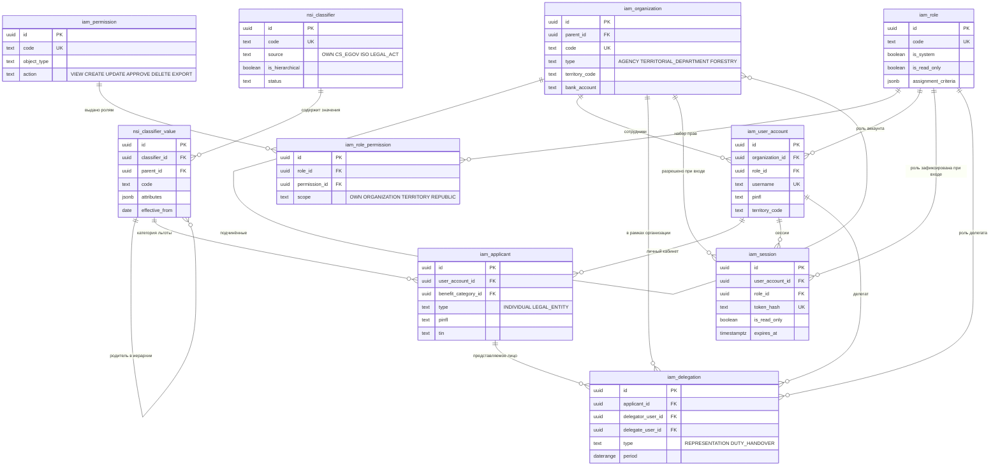
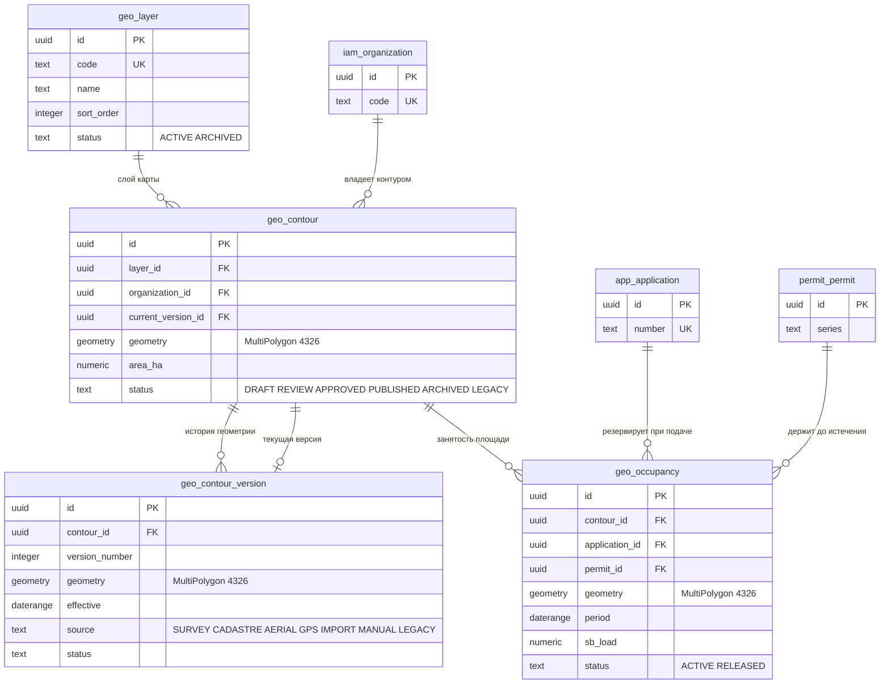
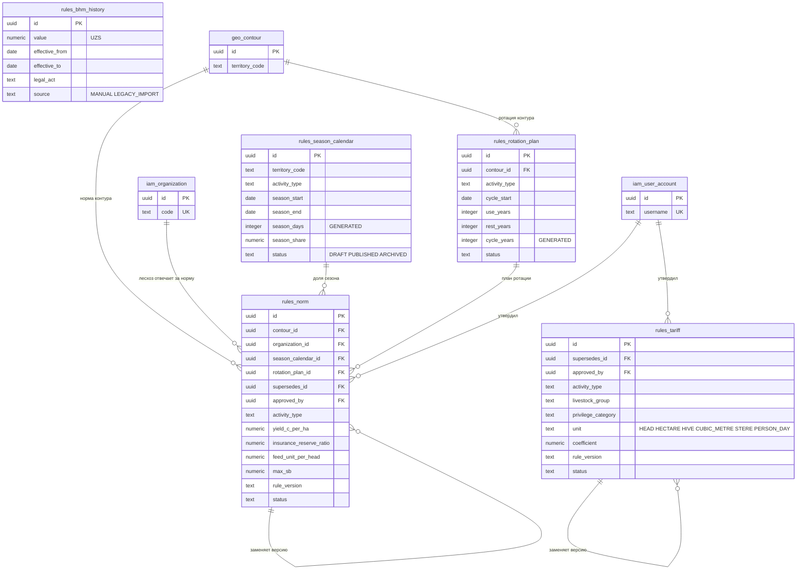
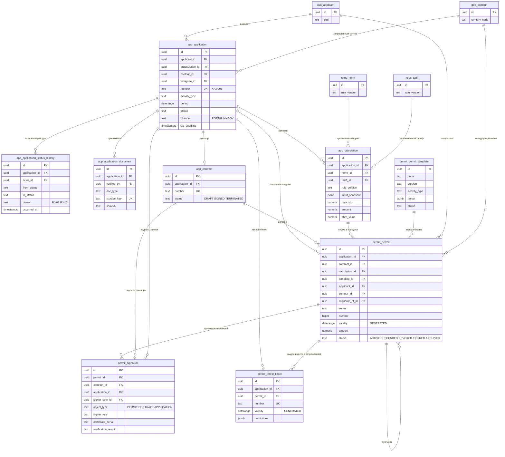
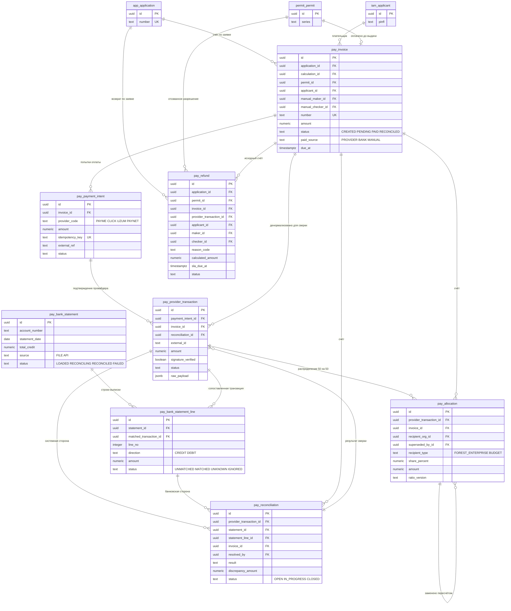
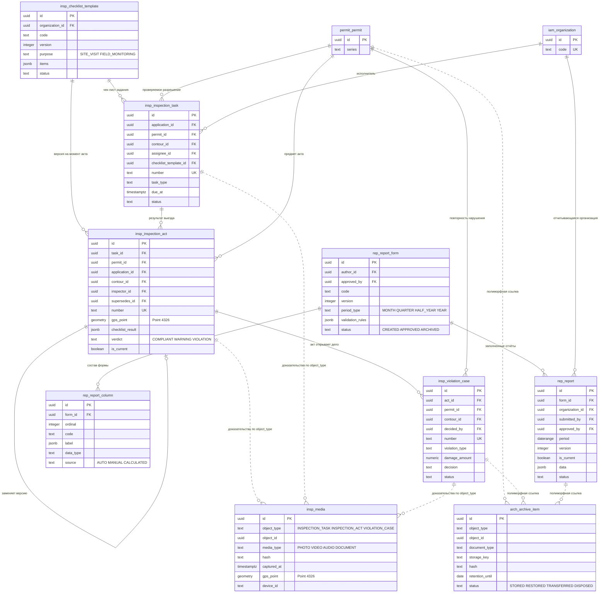
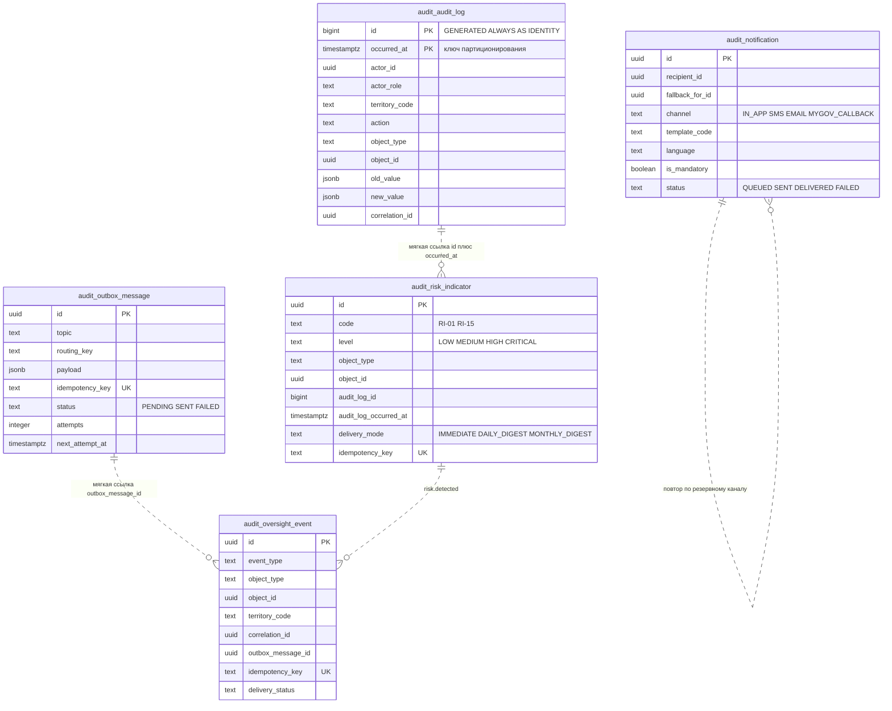

# Схема базы данных: полное описание

Физическая схема базы `ruxsatnoma_core` — все 50 таблиц одиннадцати схем, их колонки, ограничения и индексы.

> **Статус.** Схема написана целиком и **10 августа 2026 накатана на живую базу без единой ошибки** — PostgreSQL 18.1 + PostGIS 3.6 (`USE_GEOS=1 USE_PROJ=1 USE_STATS=1`), одной командой `docker compose up`. Восемь инвариантов проверены тестом на реальных вставках.
>
> **Что дальше.** Сырой DDL из репозитория кода удалён намеренно: миграции пишут разработчики через Alembic, а не технический лидер руками. Этот документ — задание на реализацию: по нему пишутся модели SQLAlchemy 2.0 и миграции. Знание, добытое проверкой на живой базе, зафиксировано в разделах 6 и 7.
>
> **Где обоснования.** Почему ограничение живёт в базе, а не в коде, почему деньги `numeric(18,2)`, почему нет мягкого удаления и как устроено разделение баз — в [`database.md`](database.md). Здесь — состав.

| Показатель | Значение |
|---|---|
| Схем | 11 |
| Таблиц | 50, плюс 12 месячных секций журнала аудита |
| Индексов | 268 |
| Ограничений `CHECK` | 300 |
| Внешних ключей | 122 |
| `EXCLUDE`-ограничений | 8 |
| RLS-политик | 5 |
| Последовательностей | 2 |

**Содержание**

1. [Сводка по схемам](#1-сводка-по-схемам)
2. [Общие правила](#2-общие-правила)
3. [ER-диаграммы по доменам](#3-er-диаграммы-по-доменам)
4. [Описание таблиц](#4-описание-таблиц)
5. [Ограничения, которые держит база, а не код](#5-ограничения-которые-держит-база-а-не-код)
6. [Что проверено на живой базе](#6-что-проверено-на-живой-базе)
7. [Три дефекта проектной схемы](#7-три-дефекта-проектной-схемы)
8. [Что делать разработчикам](#8-что-делать-разработчикам)

---

## 1. Сводка по схемам

Схема СУБД равна модулю. Модуль пишет только в свою схему, чужие данные читает через публичный API модуля. Это шов, по которому `geo` и `pay` можно будет вынести в отдельные сервисы.

| Схема | Таблиц | За что отвечает | Модуль-владелец |
|---|---|---|---|
| `nsi` | 2 | Справочники и классификаторы: виды деятельности, виды скота, территории, типы документов, причины отказа `RJ-01`…`RJ-15`, страны ISO-3166-1 | classifiers |
| `iam` | 8 | Организации, роли, права, аккаунты, заявители, делегированные полномочия, сессии | iam |
| `geo` | 4 | Реестр слоёв карты, контуры, версии геометрии, занятость контура | gis |
| `rules` | 5 | Нормы ВМҚ 689, тарифы ВМҚ 278, сезонные календари, планы ротации, история базовой расчётной величины (БҲМ) | rules |
| `app` | 5 | Заявки, история статусов, приложенные документы, расчёты, договоры | application |
| `permit` | 4 | Разрешения, версионируемые шаблоны бланка, ЭЦП, лесные билеты | permit, signature |
| `pay` | 8 | Счета, попытки оплаты, транзакции провайдеров, банковские выписки, сверка, реестр распределения, возвраты | payment |
| `insp` | 5 | Задания на проверку, электронные акты, доказательная медиатека, дела о нарушениях, конструктор чек-листов | inspection |
| `rep` | 3 | Формы отчётности, их колонки, заполненные отчёты | reporting |
| `arch` | 1 | Архив документов с контролем целостности и сроками хранения | archive |
| `audit` | 5 | Неизменяемый журнал аудита, риск-индикаторы `RI-01`…`RI-15`, события цифрового надзора, outbox, уведомления | audit, outbox |

Порядок применения файлов — по имени: `nsi` → `iam` → `geo` → `rules` → `app` → `audit` → `permit` → `pay` → `insp` → `rep` → `arch`, затем перекрёстные внешние ключи, права и RLS. Порядок важен: таблица не может ссылаться на ту, что появится позже.

**Расширения PostgreSQL**, без которых схема не соберётся:

| Расширение | Зачем |
|---|---|
| `postgis` | Пространственные типы, индексы и функции. П. 4.2.5 ТЗ |
| `btree_gist` | Позволяет скалярным типам участвовать в `EXCLUDE`. Нужно для `application_no_active_duplicate`, где `uuid`-равенство смешано с пересечением `daterange` |
| `pg_trgm` | Триграммный поиск по именам. Замена морфологическому полнотекстовому поиску, пока нет узбекского словаря. П. 4.2.3 ТЗ |
| `pgcrypto` | `gen_random_uuid()` для первичных ключей |

---

## 2. Общие правила

Действуют для всех таблиц, ниже в описаниях не повторяются.

| Правило | Как |
|---|---|
| Первичные ключи | `uuid PRIMARY KEY DEFAULT gen_random_uuid()`. Исключение — `audit.audit_log`, где ключ составной: `(id, occurred_at)`, `id` — `bigint GENERATED ALWAYS AS IDENTITY` |
| Время | Только `timestamptz` |
| Деньги | Только `numeric(18,2)`. Никогда `float` и `int` |
| Площади | `numeric(12,4)` гектаров. Геометрия — источник истины, площадь денормализована для скорости |
| Периоды | `daterange` — разрешения выдаются по датам, не по моментам |
| Перечисления | `text` + `CHECK` со списком значений. **Не `enum`**: тип-перечисление больно менять миграцией, а списки ещё вырастут (вопрос О9 добавляет седьмой вид деятельности, вопрос О10 — статус перед `SUBMITTED`) |
| Удаление | Нет ни физического, ни мягкого. Вместо него `status` со значением `ARCHIVED` |
| Аудит строки | `created_at`, `updated_at` (`timestamptz NOT NULL DEFAULT now()`), `created_by`, `updated_by` (`uuid` без внешнего ключа — это след аудита, а не доменная связь). Есть почти везде. Исключения перечислены явно |
| След миграции | Таблицы, участвующие в переносе данных, несут `legacy_id bigint` и `legacy_table text`, парность проверяется `CHECK ((legacy_id IS NULL) = (legacy_table IS NULL))`, а уникальный частичный индекс по паре делает повторный прогон миграции безопасным |
| Территория | `territory_code text` денормализован на каждую таблицу, по которой фильтрует прокурор. Без него RLS-политика превращается в подзапрос с соединением и требование «поиск ≤ 3 секунд» (п. 4.1.4) не выполняется |
| Геометрия | SRID 4326 (WGS 84), тип `geometry(MultiPolygon, 4326)`, для точек — `geometry(Point, 4326)`. У каждой геометрической колонки свой GiST-индекс. Площадь считается приведением к `geography`, что даёт метры без выбора проекции |
| Валидность геометрии | `CHECK (geometry IS NULL OR ST_IsValid(geometry))` на каждой таблице с геометрией. Самопересечение отбивает база, а не приложение. Ошибка `ERR-GIS-001` |

**Журналы — отдельный случай.** `app.application_status_history`, `audit.audit_log`, `audit.risk_indicator` и `audit.oversight_event` не несут `updated_at`/`updated_by`: строка пишется один раз и не редактируется. Вместо этого у них `occurred_at`/`detected_at` и указание на действующее лицо. `audit.outbox_message` и `audit.notification` — исключение внутри исключения: это конечные автоматы доставки, их строки меняются после вставки.

---

## 3. ER-диаграммы по доменам

Пятьдесят таблиц на одной диаграмме нечитаемы, поэтому здесь семь срезов. На каждом показаны только первичный ключ, внешние ключи и три-пять значимых полей — полный состав колонок в разделе 4.

### 3.1. Идентификация: `nsi` + `iam`



### 3.2. Пространственные данные: `geo`



### 3.3. Правила и расчёт: `rules`



`rules.bhm_history` ни на что не ссылается и ни на что не ссылаются: значение БҲМ разрешается по дате и замораживается в `app.calculation.bhm_value`.

### 3.4. Заявка и разрешение: `app` + `permit`



### 3.5. Платежи: `pay`



### 3.6. Инспекция и отчётность: `insp` + `rep` + `arch`



Пунктирные связи — полиморфные: они выражены парой `object_type` + `object_id` и **не подкреплены внешним ключом**. Так сделано намеренно: медиатека обслуживает три разных владельца одним конвейером загрузки, а архив обязан пережить объект, который он архивирует.

### 3.7. Сквозное: `audit`



**Ни одна связь этой схемы не подкреплена внешним ключом.** Журнал переживает объекты, которые описывает, включая удалённые, поэтому все ссылки полиморфные и мягкие. `audit.risk_indicator` ссылается на журнал обеими половинами его составного ключа — `audit_log_id` и `audit_log_occurred_at`, — и парность проверяется `CHECK`, но не внешним ключом.

---

## 4. Описание таблиц

Порядок — как в применении файлов. Колонки `created_at`, `updated_at`, `created_by`, `updated_by`, `legacy_id`, `legacy_table` описаны один раз в разделе 2 и ниже не повторяются.

### 4.1. Схема `nsi` — справочники

Четырнадцать реестров ТЗ (п. 4.1.10) описаны двумя таблицами: реестр описывается один раз, его значения лежат версионированными строками под ним. Ничего никогда не удаляется — значение, на которое уже ссылаются живые записи, переводится в `ARCHIVED` (сценарий С23, шаг 23.3).

#### `nsi.classifier`

Описание реестра: что это за справочник и откуда берутся его значения. Примерно четырнадцать строк на первый день.

| Колонка | Тип | Назначение |
|---|---|---|
| `id` | `uuid` PK | |
| `code` | `text NOT NULL UNIQUE` | Машинное имя для кода приложения: `activity_type`, `livestock_species`, `region`, `district`, `forestry`, `document_type`, `reject_reason`, `country` |
| `name_uz` / `name_ru` / `name_en` | `text` | `name_uz` обязательно |
| `description` | `text` | |
| `source` | `text NOT NULL DEFAULT 'OWN'` | `OWN` ведёт администратор, `CS_EGOV` синхронизируется с cs.egov.uz регламентным заданием, `ISO` — ISO-3166-1, `LEGAL_ACT` — значения из постановления, вне поправки не редактируются |
| `external_registry` | `text` | Имя внешнего реестра-источника |
| `is_hierarchical` | `boolean NOT NULL DEFAULT false` | Территориальные реестры — деревья: регион → район → лесхоз → лесничество → квартал |
| `status` | `text NOT NULL DEFAULT 'ACTIVE'` | `DRAFT`, `ACTIVE`, `ARCHIVED` |

#### `nsi.classifier_value`

Значения реестра, версионированные периодом действия, чтобы `classifiers.list(type, on_date)` отвечал на вопрос «что действовало на такую-то дату» (п. 4.2.15).

| Колонка | Тип | Назначение |
|---|---|---|
| `id` | `uuid` PK | |
| `classifier_id` | `uuid NOT NULL` → `nsi.classifier` | |
| `code` | `text NOT NULL` | Собственный устойчивый идентификатор внутри реестра: `GRAZING`, `HAYMAKING`, `RJ-04`, `CATTLE_ADULT`. На него ссылаются разрешения и расчёты, поэтому после публикации не переписывается |
| `name_uz` / `name_ru` / `name_en` | `text` | |
| `parent_id` | `uuid` → `nsi.classifier_value` | Иерархия внутри реестра |
| `external_code` | `text` | Код того же значения в системе-источнике: СОАТО для cs.egov.uz, alpha-2 для ISO-3166-1. Держится отдельно от `code`, чтобы перенумерация на той стороне не задевала наши идентификаторы |
| `sort_order` | `integer NOT NULL DEFAULT 0` | Порядок в выпадающем списке |
| `attributes` | `jsonb NOT NULL DEFAULT '{}'` | Полезная нагрузка, зависящая от реестра: коэффициенты условных голов (ВМҚ 689, приложение 5), правовое основание отказа, SRID слоя GIS. Структурная колонка заводится только тогда, когда по полю нужно искать |
| `effective_from` / `effective_to` | `date` | Период действия. `effective_from NOT NULL DEFAULT CURRENT_DATE` |
| `status` | `text NOT NULL DEFAULT 'ACTIVE'` | `DRAFT`, `ACTIVE`, `ARCHIVED` |

**Ограничения:** `UNIQUE (classifier_id, code)`; `parent_id IS DISTINCT FROM id`; `effective_to >= effective_from`.

**Индексы:** `(classifier_id, status, sort_order)` — запрос за каждым выпадающим списком; частичный по `parent_id` — обход дерева территорий; `(classifier_id, effective_from, effective_to)` — выборка на дату; уникальный частичный по `(legacy_table, legacy_id)`.

---

### 4.2. Схема `iam` — субъекты и доступ

Два правила формируют схему. Первое: ничего не удаляется, аккаунты, организации и заявители уходят в `ARCHIVED`. Второе: каждое право оценивается внутри территории и организации пользователя (ABAC), поэтому `territory_code` лежит на самом аккаунте, копируется в сессию при входе и служит колонкой, по которой фильтруют RLS-политики прокурора.

#### `iam.organization`

84 организации ТЗ, выстроенные деревом через `parent_id`: Агентство в корне, ниже территориальные управления, под ними лесхозы и лесничества.

| Колонка | Тип | Назначение |
|---|---|---|
| `id` | `uuid` PK | |
| `code` | `text NOT NULL UNIQUE` | Код из реестра лесхозов, печатается на разрешении |
| `name` / `short_name` | `text` | `name` обязательно |
| `type` | `text NOT NULL` | `AGENCY`, `TERRITORIAL_DEPARTMENT`, `FORESTRY`, `FOREST_DISTRICT`, `HUNTING_DEPARTMENT`. Тип вместе с территорией определяет назначение заявки исполнителю (сценарий С4, шаг 1) |
| `parent_id` | `uuid` → `iam.organization` | |
| `territory_code` | `text NOT NULL` | Основа ABAC, назначения и RLS |
| `territory_scope` | `text NOT NULL DEFAULT 'DISTRICT'` | `REPUBLIC` у Агентства, `REGION` у территориального управления, `DISTRICT` у лесхоза |
| `tin` | `text` | ИНН (СТИР) |
| `bank_account`, `bank_name`, `bank_mfo` | `text` | Расчётные реквизиты, перенесены из `department_account`. Нужны платёжному модулю, чтобы разнести поступление между получателями |
| `address`, `phone`, `email` | `text` | |
| `status` | `text NOT NULL DEFAULT 'ACTIVE'` | `ACTIVE`, `SUSPENDED`, `ARCHIVED` |

**Ограничения:** `parent_id IS DISTINCT FROM id`; `tin ~ '^[0-9]{9}$'`; `bank_mfo ~ '^[0-9]{5}$'`.

**Индексы:** GIN-триграммный по `name`; частичный по `parent_id`; `(territory_code, status)`; уникальный частичный по паре `legacy`.

#### `iam.role`

Десять ролей поставляются с системой, администратор может создавать, копировать и править новые (сценарий С23, шаг 6), поэтому `code` не ограничен фиксированным списком.

| Колонка | Тип | Назначение |
|---|---|---|
| `id` | `uuid` PK | |
| `code` | `text NOT NULL UNIQUE` | `SYSTEM_ADMIN`, `CENTRAL_OFFICER`, `MANAGEMENT`, `EXECUTOR`, `GIS_NORM_SPECIALIST`, `ORGANIZATION_HEAD`, `INSPECTOR`, `ACCOUNTANT`, `APPLICANT`, `PROSECUTOR` |
| `name_uz` / `name_ru` / `name_en`, `description` | `text` | |
| `is_system` | `boolean NOT NULL DEFAULT false` | Защищает десять встроенных ролей от правки |
| `is_read_only` | `boolean NOT NULL DEFAULT false` | Приложение 6, третий уровень технического обеспечения: роль прокурора доступна только на чтение и в API, и в СУБД. Сессия под такой ролью направляется в пул `oversight_ro` |
| `assignment_criteria` | `jsonb NOT NULL DEFAULT '{}'` | Какое подразделение и какую должность должен занимать пользователь, чтобы роль вообще предлагалась (сценарий С23, шаг 2) |
| `status` | `text NOT NULL DEFAULT 'ACTIVE'` | `ACTIVE`, `ARCHIVED` |

#### `iam.permission`

Каталог пар «объект — действие» из приложения 4: семнадцать объектов на шесть действий. Данные фиксированные, правятся только поправкой к ТЗ. Каталог сделан таблицей, а не константой в коде, потому что сценарий С23 шаг 6 считает нераспределённые функции.

| Колонка | Тип | Назначение |
|---|---|---|
| `id` | `uuid` PK | |
| `code` | `text NOT NULL UNIQUE` | Складывается как `OBJECT_TYPE.ACTION`, например `APPLICATION.APPROVE` |
| `object_type` | `text NOT NULL` | `APPLICATION`, `CALCULATION`, `CONTOUR`, `NORM`, `PERMIT`, `PAYMENT`, `REFUND`, `INSPECTION_ACT`, `VIOLATION_CASE`, `REPORT`, `DASHBOARD`, `USER_AND_ROLE`, `CLASSIFIER`, `AUDIT_LOG`, `SYSTEM_SETTINGS`, `BACKUP`, `ARCHIVE` |
| `action` | `text NOT NULL` | Шесть отметок приложения 4: `VIEW`, `CREATE`, `UPDATE`, `APPROVE`, `DELETE`, `EXPORT` |
| `name_uz` / `name_ru` / `name_en`, `description` | `text` | |
| `status` | `text NOT NULL DEFAULT 'ACTIVE'` | `ACTIVE`, `ARCHIVED` |

**Ограничения:** `UNIQUE (object_type, action)`.

#### `iam.role_permission`

Какие права держит роль и насколько широко каждое действует. Ширина — это ABAC-половина матрицы.

| Колонка | Тип | Назначение |
|---|---|---|
| `id` | `uuid` PK | |
| `role_id` | `uuid NOT NULL` → `iam.role` | |
| `permission_id` | `uuid NOT NULL` → `iam.permission` | |
| `scope` | `text NOT NULL DEFAULT 'ORGANIZATION'` | `OWN` — только свои записи (заявитель), `ORGANIZATION` — своя организация (исполнитель), `TERRITORY`, `REPUBLIC` (руководство) |

**Ограничения:** `UNIQUE (role_id, permission_id)`. **Индексы:** по `permission_id`.

#### `iam.user_account`

Все, кто входит в систему: сотрудники Агентства и его организаций, инспекторы, бухгалтеры, прокуроры, а также физические и юридические лица, подающие заявки через портал или my.gov.uz. Пароли из старой системы не переносятся: Django-хеши несовместимы с Argon2id, а у заявителя в новой модели пароля нет вовсе — только OneID или E-IMZO.

| Колонка | Тип | Назначение |
|---|---|---|
| `id` | `uuid` PK | |
| `username` | `text NOT NULL UNIQUE` | Имя для входа; у внутренних сотрудников — адрес электронной почты (сценарий С1) |
| `email`, `phone` | `text` | |
| `email_verified_at`, `phone_verified_at` | `timestamptz` | Подтверждение одноразовым кодом при регистрации (сценарий С2, шаг 6) |
| `pinfl` | `text` | ПИНФЛ физического лица (ЖШШИР) |
| `full_name` | `text NOT NULL` | |
| `position` | `text` | Должность |
| `organization_id` | `uuid` → `iam.organization` | Пусто у внешних пользователей: заявитель не принадлежит организации |
| `role_id` | `uuid NOT NULL` → `iam.role` | |
| `territory_code`, `territory_scope` | `text NOT NULL` | У сотрудника берётся из организации, у заявителя — из адреса регистрации |
| `password_hash` | `text` | Argon2id. Пусто там, где вход по паролю не разрешён: заявители и роль прокурора, которому п. 4.1.6 запрещает пароль прямо |
| `password_changed_at` | `timestamptz` | |
| `must_change_password` | `boolean NOT NULL DEFAULT false` | Администратор выдаёт одноразовый пароль, который меняется при первом входе (сценарий С23, шаг 4) |
| `mfa_enabled` | `boolean NOT NULL DEFAULT false` | Обязательно для внутренних сотрудников с паролем (сценарий С1, шаг 4) |
| `mfa_secret` | `text` | Секрет шифруется приложением до записи |
| `oneid_subject` | `text` | Идентификатор в OneID |
| `eimzo_certificate_serial` | `text` | Серийный номер сертификата E-IMZO |
| `failed_login_count` | `integer NOT NULL DEFAULT 0` | |
| `locked_until` | `timestamptz` | Ставится при превышении лимита попыток: `ERR-AUTH-003` |
| `last_login_at` | `timestamptz` | |
| `authority_valid_until` | `date` | Конец полномочий. После этой даты вход запрещён (С1, 1.4); аккаунты прокуроров приостанавливаются автоматически по истечении мандата в «Raqamli nazorat» |
| `status` | `text NOT NULL DEFAULT 'PENDING'` | `PENDING`, `ACTIVE`, `SUSPENDED`, `ARCHIVED` |

**Ограничения:** `pinfl ~ '^[0-9]{14}$'`; `failed_login_count >= 0`.

**Индексы:** уникальные частичные по `pinfl` (один аккаунт на человека — сценарий С2, 2.5: повторная регистрация под существующим ПИНФЛ уводится на вход) и по `oneid_subject`; `(organization_id, status)` частичный; `(territory_code, status)`; уникальный частичный по паре `legacy`.

#### `iam.applicant`

Физическое или юридическое лицо, за которое подаётся заявка. Отделено от аккаунта, потому что один аккаунт может действовать за юридическое лицо по доверенности, а реквизиты юридического лица переживают человека, который его зарегистрировал.

| Колонка | Тип | Назначение |
|---|---|---|
| `id` | `uuid` PK | |
| `user_account_id` | `uuid` → `iam.user_account` | Личный кабинет, если он есть |
| `type` | `text NOT NULL` | `INDIVIDUAL`, `LEGAL_ENTITY` |
| `pinfl` | `text` | ПИНФЛ (ЖШШИР), 14 цифр |
| `tin` | `text` | ИНН (СТИР), 9 цифр |
| `full_name` | `text NOT NULL` | ФИО физического лица либо наименование юридического. Печатается на разрешении и ищется прокурором (сценарий С22) |
| `birth_date`, `birth_place`, `citizenship_code` | | Заполняются из OneID и Центра персонализации (С2, шаг 3) |
| `passport_series`, `passport_number`, `passport_issued_by`, `passport_issued_at` | | Паспортные данные |
| `director_name`, `legal_address` | `text` | Только юридическое лицо, из реестра юридических лиц |
| `territory_code` | `text NOT NULL` | ABAC, RLS и территория по умолчанию для заявки |
| `address`, `phone`, `email` | `text` | |
| `bank_account`, `bank_mfo` | `text` | Нужны, чтобы выплатить возврат (модуль 10.9) |
| `benefit_category_id` | `uuid` → `nsi.classifier_value` | Льгота по ВМҚ 278, пп. 9–11 |
| `verification_source` | `text` | `ONEID`, `PERSONALISATION_CENTRE`, `LEGAL_ENTITY_REGISTRY`, `MANUAL`. С2, 2.4: если внешний реестр не ответил, данные вводятся руками, а автоматическая проверка ставится в очередь — источник фиксируется |
| `verified_at` | `timestamptz` | |
| `status` | `text NOT NULL DEFAULT 'ACTIVE'` | `ACTIVE`, `SUSPENDED`, `ARCHIVED` |

**Ограничения:** формат ПИНФЛ и ИНН регулярными выражениями; `applicant_identifier_present` — у физического лица обязателен ПИНФЛ, у юридического ИНН. Выбор не исключающий: индивидуальный предприниматель несёт оба.

**Индексы:** `applicant_by_pinfl` и `applicant_by_tin` — **неуникальные**, см. раздел 7; GIN-триграммный по `full_name`; частичный по `user_account_id`; `(territory_code, status)`.

#### `iam.delegation`

Два случая в одной таблице. `REPRESENTATION` — человек действует за юридическое лицо по доверенности с указанным сроком (сценарий С2, шаг 5). `DUTY_HANDOVER` — открытая работа сотрудника передаётся коллеге перед приостановкой аккаунта (сценарий С23, шаг 5 и 23.2). Истечение срока снимает полномочия само: проверка прав читает только период.

| Колонка | Тип | Назначение |
|---|---|---|
| `id` | `uuid` PK | |
| `type` | `text NOT NULL` | `REPRESENTATION`, `DUTY_HANDOVER` |
| `applicant_id` | `uuid` → `iam.applicant` | Представляемое юридическое лицо |
| `delegator_user_id` | `uuid` → `iam.user_account` | Сотрудник, передающий дела |
| `delegate_user_id` | `uuid NOT NULL` → `iam.user_account` | Кто получает полномочия. Всегда аккаунт |
| `organization_id` | `uuid` → `iam.organization` | |
| `role_id` | `uuid` → `iam.role` | Роль, под которой действует делегат, пока держится делегирование |
| `scope` | `jsonb NOT NULL DEFAULT '{}'` | Сужение: один вид деятельности, один контур, поимённые заявки |
| `period` | `daterange NOT NULL` | Срок мандата, ограничен с обеих сторон: бессрочная доверенность не принимается |
| `document_file_id`, `document_number`, `document_issued_at` | | Скан доверенности в объектном хранилище и её реквизиты |
| `status` | `text NOT NULL DEFAULT 'ACTIVE'` | `ACTIVE`, `REVOKED`, `EXPIRED`, `ARCHIVED` |
| `revoked_at`, `revoke_reason` | | |

**Ограничения:** период непустой и ограничен с обеих сторон; `delegation_source_present` — у `REPRESENTATION` обязателен `applicant_id`, у `DUTY_HANDOVER` — `delegator_user_id`; делегат не совпадает с делегирующим; `EXCLUDE`-ограничение `delegation_no_active_overlap` — одна живая доверенность на пару «представитель + юридическое лицо» в каждый момент, иначе нельзя сказать, по какой из них подана заявка.

**Индексы:** `(delegate_user_id, status)`; частичный по `applicant_id`; GiST по `period` для регламентного задания, гасящего истёкшие мандаты.

#### `iam.session`

Сценарий С1, шаг 6: при входе роль, организация и территория разрешаются один раз и кладутся в токен; разрешённые значения хранятся здесь, чтобы отозванная роль или истёкший мандат подействовали, не дожидаясь протухания токена. Сырые токены не хранятся, только их хеши.

| Колонка | Тип | Назначение |
|---|---|---|
| `id` | `uuid` PK | |
| `user_account_id` | `uuid NOT NULL` → `iam.user_account` | |
| `token_hash` | `text NOT NULL UNIQUE` | |
| `refresh_token_hash` | `text UNIQUE` | |
| `auth_method` | `text NOT NULL` | `PASSWORD`, `PASSWORD_MFA`, `ONEID`, `EIMZO` |
| `role_id` | `uuid NOT NULL` → `iam.role` | Разрешено при входе и внутри сессии не пересчитывается |
| `organization_id` | `uuid` → `iam.organization` | |
| `territory_code`, `territory_scope` | `text` | |
| `is_read_only` | `boolean NOT NULL DEFAULT false` | Ставится для роли прокурора: запросы уходят в пул `oversight_ro` и в middleware «только GET» |
| `oversight_verified_at`, `oversight_reference` | | П. 4.1.6: мандат прокурора проверяется в «Raqamli nazorat» вживую при каждом входе и не кешируется, поэтому ссылка принадлежит сессии, а не аккаунту |
| `ip`, `user_agent`, `device` | `inet`, `text` | |
| `expires_at` | `timestamptz NOT NULL` | Время жизни сессии. Не более 30 минут для роли прокурора |
| `last_seen_at`, `ended_at` | `timestamptz` | |
| `end_reason` | `text` | `LOGOUT`, `IDLE_TIMEOUT`, `EXPIRED`, `REVOKED`, `ROLE_CHANGED` |
| `status` | `text NOT NULL DEFAULT 'ACTIVE'` | `ACTIVE`, `ENDED`, `ARCHIVED` |
| `correlation_id` | `uuid` | |

**Ограничения:** завершённая сессия обязана нести и время, и причину завершения.

**Индексы:** `(user_account_id, created_at DESC)`; частичный по `expires_at` для задания, закрывающего просроченные сессии (сценарий С1, 1.5).

---

### 4.3. Схема `geo` — пространственные данные

Модуль 10.2, сценарий С17. SRID хранения — 4326 (WGS 84), выбор предварительный: система координат остаётся открытым вопросом к Заказчику.

#### `geo.layer`

Реестр слоёв карты. Тринадцать слоёв зафиксированы модулем 10.2 и шагом 1 сценария С17 и **засеиваются самим DDL**: `FOREST_FUND`, `ORGANIZATION_BOUNDARY`, `CONTOUR`, `PASTURE`, `HAYFIELD`, `APIARY`, `RECREATION`, `RESTRICTION`, `PROTECTION`, `ROTATION`, `REST`, `WATER_POINT`, `CATTLE_ROUTE`.

| Колонка | Тип | Назначение |
|---|---|---|
| `id` | `uuid` PK | |
| `code` | `text NOT NULL UNIQUE` | Устойчивый латинский идентификатор для API, импорта и топологических проверок |
| `name` | `text NOT NULL` | Английская подпись для операторов и документации; подписи для пользователя берутся из `locales/` по коду |
| `sort_order` | `integer NOT NULL` | Порядок отрисовки на карте, по возрастанию |
| `status` | `text NOT NULL DEFAULT 'ACTIVE'` | `ACTIVE`, `ARCHIVED` |

#### `geo.contour`

Пространственная единица, на которую выдаётся разрешение. Идентичность и текущее состояние; происхождение геометрии — этажом ниже, в `geo.contour_version`, потому что разрешение остаётся привязано к версии, против которой было выдано (С17, п. 17.4).

| Колонка | Тип | Назначение |
|---|---|---|
| `id` | `uuid` PK | |
| `layer_id` | `uuid NOT NULL` → `geo.layer` | |
| `organization_id` | `uuid NOT NULL` → `iam.organization` | |
| `territory_code` | `text NOT NULL` | Денормализовано из владеющей организации для ABAC-фильтров |
| `name` | `text` | Подпись на карте |
| `geometry` | `geometry(MultiPolygon, 4326)` | Текущая геометрия, денормализованная из текущей версии: запрос занятости читает её напрямую, векторные тайлы строятся из неё, соединения быть не должно. Nullable намеренно — контуры из старой системы приходят без геометрии и лежат в статусе `LEGACY`, пока не появится настоящий контур |
| `area_ha` | `numeric(12,4)` | |
| `current_version_id` | `uuid` → `geo.contour_version` | Внешний ключ навешивается после создания `contour_version`: таблицы ссылаются друг на друга |
| `approval_doc_id` | `uuid` | Документ, которым утверждена опубликованная версия |
| `status` | `text NOT NULL DEFAULT 'DRAFT'` | `DRAFT`, `REVIEW`, `APPROVED`, `PUBLISHED`, `ARCHIVED` — жизненный цикл шага 5 сценария С17; `LEGACY` добавлен сверх ТЗ: перенесённый контур, который несёт историю, но не принимает заявок |

**Ограничения:** `ST_IsValid(geometry)` — самопересечение отбивает база, ошибка `ERR-GIS-001`; `area_ha >= 0`; `contour_publish_requires_approval` — публикация без утверждающего документа заблокирована, ошибка `ERR-GIS-005` (С17, п. 17.3); `contour_publish_requires_geometry` — опубликованный контур выбирается в заявке, значит обязан иметь контур; это и не даёт опубликовать `LEGACY`-строку как есть.

**Индексы:** GiST по `geometry`; `(layer_id, status)`, `(organization_id, status)`, `(territory_code, status)`; уникальный частичный по паре `legacy`.

#### `geo.contour_version`

Версионированная геометрия и её происхождение (шаг 4 сценария С17). Правка контура архивирует предыдущую версию, а не переписывает её, поэтому разрешение, выданное годы назад, читается против того контура, для которого выдавалось.

| Колонка | Тип | Назначение |
|---|---|---|
| `id` | `uuid` PK | |
| `contour_id` | `uuid NOT NULL` → `geo.contour` | |
| `version_number` | `integer NOT NULL` | |
| `geometry` | `geometry(MultiPolygon, 4326)` | Nullable по той же причине, что и на `geo.contour` |
| `area_ha` | `numeric(12,4)` | |
| `source` | `text` | Откуда взят контур: `SURVEY`, `CADASTRE`, `AERIAL`, `GPS`, `IMPORT`, `MANUAL`, `LEGACY` |
| `accuracy_m` | `numeric(8,2)` | Позиционная точность в метрах |
| `survey_date` | `date` | |
| `effective` | `daterange NOT NULL` | `effective_from` и `effective_to` из ТЗ, одной колонкой |
| `approval_doc_id` | `uuid` | |
| `status` | `text NOT NULL DEFAULT 'DRAFT'` | Тот же список, что у контура |

**Ограничения:** `UNIQUE (contour_id, version_number)`; `version_number > 0`; валидность геометрии; неотрицательные площадь и точность; публикация требует и утверждающего документа, и геометрии; `EXCLUDE` `contour_version_no_overlapping_published` — не более одной опубликованной версии контура на любой день. Это сильнее частичного уникального индекса: сменную версию всё ещё можно подготовить с будущим периодом действия.

**Индексы:** GiST по `geometry`; `(contour_id, version_number DESC)`.

#### `geo.occupancy`

Площадь контура, занятая заявкой или разрешением. Резервируется при переходе заявки в `SUBMITTED`, освобождается на `REJECTED`, `CANCELLED`, `EXPIRED_UNPAID` и при истечении разрешения.

| Колонка | Тип | Назначение |
|---|---|---|
| `id` | `uuid` PK | |
| `contour_id` | `uuid NOT NULL` → `geo.contour` | |
| `application_id` | `uuid` → `app.application` | Внешний ключ навешивается последним файлом, см. раздел 7 |
| `permit_id` | `uuid` → `permit.permit` | То же |
| `geometry` | `geometry(MultiPolygon, 4326) NOT NULL` | |
| `period` | `daterange NOT NULL` | |
| `sb_load` | `numeric(12,2) NOT NULL` | Нагрузка в условных головах |
| `status` | `text NOT NULL` | `ACTIVE`, `RELEASED` |

**Ограничения:** валидность геометрии; `sb_load >= 0`; `occupancy_has_owner` — строка обязана принадлежать либо заявке, либо разрешению.

**Индексы:** GiST по `geometry`; `occupancy_lookup` — GiST по `(contour_id, period) WHERE status = 'ACTIVE'`, рабочая лошадь проверки лимита: контур, пересекающийся период, только активные строки, ответ обязан уложиться в пять секунд. Именно ради `uuid` в GiST-индексе установлен `btree_gist`. Плюс частичные индексы по `application_id` и `permit_id` — освобождение занятости начинается с владельца.

---

### 4.4. Схема `rules` — нормы, тарифы, календари

Модуль 10.3, сценарий С18. Три идеи формируют всю схему.

**Версионирование.** Норма и тариф не правятся на месте. Изменение — новая строка со своим периодом действия и своим `rule_version`. Уже выданные разрешения продолжают указывать на версию, которой были посчитаны, через `app.calculation.rule_version`, и не пересчитываются.

**Утверждение.** Ничто не становится `PUBLISHED` без документа, который это утверждает, и человека, который утвердил (шаг 18.1). Ретроспективное изменение требует второго утверждающего — принцип «четырёх глаз», шаг 18.2.

**Коэффициенты — это данные.** Числовые значения пока неизвестны: вопросы Н1 (коэффициенты условных голов), Н2 (коэффициенты тарифов и базовая величина) и Н3 (сезонные календари и ротация) открыты. Поэтому каждый коэффициент — колонка, которую заполняют строками, и никогда не литерал в `DEFAULT` или `CHECK`. Когда значения придут, схема не изменится.

Шесть видов деятельности допускаются Лесным кодексом и ВМҚ 278: `GRAZING`, `HAYMAKING`, `BEEKEEPING`, `RECREATION`, `FIREWOOD`, `RESEARCH`.

#### `rules.bhm_history`

Базовая расчётная величина (БҲМ), пересматриваемая ежегодно. Сумма = БҲМ × коэффициент × количество. Значение лежит здесь один раз и разрешается по дате, а не копируется в каждую строку тарифа: базовая величина меняется каждый год, коэффициенты — нет. Каждый расчёт замораживает использованное значение в `app.calculation.bhm_value`.

| Колонка | Тип | Назначение |
|---|---|---|
| `id` | `uuid` PK | |
| `value` | `numeric(18,2) NOT NULL` | Сумма в сумах |
| `effective_from` | `date NOT NULL` | |
| `effective_to` | `date` | Пусто, пока значение действует |
| `legal_act` | `text` | Акт, установивший значение |
| `approval_doc_id` | `uuid` | Nullable: перенесённые значения документа не несут |
| `source` | `text NOT NULL DEFAULT 'MANUAL'` | `MANUAL`, `LEGACY_IMPORT` |

**Ограничения:** `value > 0`; порядок периода; `EXCLUDE` `bhm_history_no_overlap` по `daterange(effective_from, effective_to, '[]')` — ровно одно значение базовой величины действует в каждый момент.

**Индексы:** `(effective_from DESC)`.

#### `rules.season_calendar`

Длительность сезона выпаса и сенокошения по территориям. Даёт `Season_share` в формуле `Oz = Yield_c_per_ha × Area_ha × Season_share`.

| Колонка | Тип | Назначение |
|---|---|---|
| `id` | `uuid` PK | |
| `territory_code` | `text NOT NULL` | Код СОАТО региона: сезон различается по регионам |
| `activity_type` | `text NOT NULL` | Один из шести |
| `season_start`, `season_end` | `date NOT NULL` | |
| `season_days` | `integer GENERATED ALWAYS AS ((season_end - season_start) + 1) STORED` | Вычисляемая колонка |
| `season_share` | `numeric(8,6) NOT NULL` | Доля года, которую покрывает сезон |
| `status` | `text NOT NULL DEFAULT 'DRAFT'` | `DRAFT`, `PUBLISHED`, `ARCHIVED` |
| `effective_from`, `effective_to` | `date` | |
| `approval_doc_id` | `uuid` | |
| `notes` | `text` | |

**Ограничения:** известный вид деятельности и статус; `season_end >= season_start`; `season_share` в интервале (0, 1]; публикация требует утверждающего документа; `EXCLUDE` `season_calendar_no_overlapping_published` по `(territory_code, activity_type, период)` — один календарь в силе на территорию и вид деятельности, чтобы поиск по дате не мог вернуть две строки.

**Индексы:** `(territory_code, activity_type, effective_from DESC) WHERE status = 'PUBLISHED'`.

#### `rules.rotation_plan`

Годы пользования, сменяемые годами отдыха, по контуру. Ротация пространственна: отдыхает пастбище, а не область. План — цикл, стартующий в `cycle_start` и повторяющийся: `use_years` пользования, затем `rest_years` отдыха. Заявка, чей период попадает в год отдыха, отклоняется с `ERR-NORM-003` и `RJ-07`, а ответ называет ближайшее разрешённое окно — поэтому хранится цикл, а не текущая фаза.

| Колонка | Тип | Назначение |
|---|---|---|
| `id` | `uuid` PK | |
| `contour_id` | `uuid NOT NULL` → `geo.contour` | |
| `activity_type` | `text NOT NULL` | |
| `cycle_start` | `date NOT NULL` | Первый день первого года пользования |
| `use_years`, `rest_years` | `integer NOT NULL` | |
| `cycle_years` | `integer GENERATED ALWAYS AS (use_years + rest_years) STORED` | |
| `status` | `text NOT NULL DEFAULT 'DRAFT'` | `DRAFT`, `PUBLISHED`, `ARCHIVED` |
| `effective_from`, `effective_to` | `date` | |
| `approval_doc_id` | `uuid` | |
| `notes` | `text` | |

**Ограничения:** `use_years >= 1`, `rest_years >= 0`; публикация требует утверждающего документа; `EXCLUDE` по `(contour_id, activity_type, период)` среди опубликованных.

**Индексы:** `(contour_id, activity_type, effective_from DESC) WHERE status = 'PUBLISHED'`.

#### `rules.norm`

Версионированная норма пользования на контур и вид деятельности. Держит всю цепочку ВМҚ 689 вместе с исходными данными, чтобы `max_sb` можно было вывести заново из одной строки годы спустя:

```
Oz     = yield_c_per_ha * area_ha * season_share
Oz_eff = Oz * insurance_reserve_ratio
max_sb = floor(Oz_eff / feed_unit_per_head)
```

`insurance_reserve_ratio` и `feed_unit_per_head` — колонки, а не литералы: формула принадлежит движку правил, числа — строке, которая действовала. Поправка к ВМҚ 689 становится новой версией нормы, а не переписыванием прошлых расчётов. Цепочка применима к `GRAZING`; остальные пять видов оплачиваются за гектар, улей или кубометр и лимита условных голов не несут — у них эти колонки пусты.

| Колонка | Тип | Назначение |
|---|---|---|
| `id` | `uuid` PK | |
| `contour_id` | `uuid NOT NULL` → `geo.contour` | |
| `activity_type` | `text NOT NULL` | |
| `organization_id` | `uuid` → `iam.organization` | Лесхоз, отвечающий за норму; сообщается заявителю вместе с `ERR-NORM-001` |
| `survey_doc_id` | `uuid` | Документ геоботанического обследования |
| `survey_date` | `date` | |
| `yield_c_per_ha` | `numeric(12,4)` | Центнеров корма на гектар |
| `area_ha` | `numeric(12,4)` | Площадь контура на момент расчёта |
| `season_calendar_id` | `uuid` → `rules.season_calendar` | |
| `season_share` | `numeric(8,6)` | Скопировано из календаря и заморожено вместе с версией |
| `rotation_plan_id` | `uuid` → `rules.rotation_plan` | |
| `insurance_reserve_ratio` | `numeric(6,4)` | Страховой запас по ВМҚ 689 |
| `feed_unit_per_head` | `numeric(10,4)` | Центнеров кормовых единиц на условную голову |
| `max_sb` | `numeric(12,2)` | Максимальная нагрузка контура в условных головах |
| `rule_version` | `text NOT NULL` | |
| `approval_doc_id` | `uuid` | **Nullable намеренно**, см. раздел 7 |
| `status` | `text NOT NULL DEFAULT 'DRAFT'` | `DRAFT`, `REVIEW`, `APPROVED`, `PUBLISHED`, `ARCHIVED` |
| `effective_from`, `effective_to` | `date` | |
| `approved_by` | `uuid` → `iam.user_account` | Доменная связь, поэтому внешний ключ есть — в отличие от `created_by` |
| `approved_at` | `timestamptz` | |
| `is_retroactive` | `boolean NOT NULL DEFAULT false` | |
| `retroactive_approved_by` | `uuid` → `iam.user_account` | Второй утверждающий |
| `supersedes_id` | `uuid` → `rules.norm` | Какую версию заменяет |
| `notes` | `text` | |

**Ограничения:** `norm_published_requires_approval` — публикация требует документа, утверждающего и времени утверждения; `norm_retroactive_requires_maker_checker` — ретроспективная версия требует второй пары глаз; `norm_published_grazing_is_complete` — опубликованная норма выпаса обязана нести все числа, из которых выводится `max_sb`; диапазонные проверки на долю сезона и страховой запас (0, 1]; `area_ha > 0`, `feed_unit_per_head > 0`, `max_sb >= 0`; `supersedes_id <> id`; `EXCLUDE` `norm_no_overlapping_published` — `rules.get_published_norm(contour_id, activity, on_date)` обязан вернуть одну строку или ни одной, но не две.

**Индексы:** `(contour_id, activity_type, effective_from DESC) WHERE status = 'PUBLISHED'`; `(rule_version)` — воспроизведение старого расчёта начинается с версии правил.

#### `rules.tariff`

Версионированные платёжные коэффициенты ВМҚ 278. Базовая величина здесь не повторяется, она разрешается из `rules.bhm_history` по дате; строка тарифа несёт только коэффициент и потому переживает ежегодный пересмотр базовой величины.

| Колонка | Тип | Назначение |
|---|---|---|
| `id` | `uuid` PK | |
| `activity_type` | `text NOT NULL` | |
| `livestock_group` | `text` | Только выпас. Двенадцать групп приложения 5 к ВМҚ 689: `CATTLE_ADULT`, `HORSE_ADULT`, `CAMEL_ADULT`, `DONKEY_ADULT`, те же четыре в варианте `_YOUNG`, `SHEEP_OVER_6M`, `GOAT_OVER_6M`, `LAMB_UNDER_6M`, `KID_UNDER_6M` |
| `privilege_category` | `text` | Пусто означает базовую ставку. Категории льгот пп. 9–11 ВМҚ 278 ждут ответа на вопрос Н4, поэтому колонка — открытый код классификатора без списка значений |
| `unit` | `text NOT NULL` | `HEAD`, `HECTARE`, `HIVE`, `CUBIC_METRE`, `STERE`, `PERSON_DAY` |
| `coefficient` | `numeric(12,6) NOT NULL` | Множитель базовой величины |
| `rule_version` | `text NOT NULL` | |
| `approval_doc_id` | `uuid NOT NULL` | См. раздел 7 |
| `status` | `text NOT NULL DEFAULT 'DRAFT'` | `DRAFT`, `REVIEW`, `APPROVED`, `PUBLISHED`, `ARCHIVED` |
| `effective_from`, `effective_to` | `date` | |
| `approved_by`, `approved_at` | | |
| `is_retroactive`, `retroactive_approved_by` | | Принцип «четырёх глаз» |
| `supersedes_id` | `uuid` → `rules.tariff` | |
| `notes` | `text` | |

**Ограничения:** `tariff_livestock_group_belongs_to_grazing` — равенство `(activity_type = 'GRAZING') = (livestock_group IS NOT NULL)`: группа скота есть тогда и только тогда, когда это выпас; `coefficient >= 0`; публикация требует документа, утверждающего и времени; ретроспектива требует второго утверждающего; `EXCLUDE` `tariff_no_overlapping_published` по `(activity_type, COALESCE(livestock_group,''), COALESCE(privilege_category,''), период)` — `rules.get_tariff(activity, on_date)` однозначен для каждой комбинации группы и льготы.

**Индексы:** `(activity_type, effective_from DESC) WHERE status = 'PUBLISHED'`; `(rule_version)`.

---

### 4.5. Схема `app` — заявки и workflow

Модуль 10.1, сценарии С3–С8, конечный автомат из приложения 5. Ядро системы. Три вещи здесь несущие:

* `application_no_active_duplicate` — ТЗ требует контроля дублей «ограничением СУБД» с KPI «ноль дублей» (п. 4.2.10, сценарий С3 шаг 7). Это ограничение, а не код приложения, именно потому, что код можно обойти;
* `calculation.rule_version` и `calculation.input_snapshot` — одинаковый вход обязан всегда давать одинаковый результат, и любой расчёт обязан оставаться объяснимым годы спустя (пп. 4.2.15 и 4.3.1);
* каждая смена статуса журналируется в `application_status_history`. Переход никогда не бывает голым `UPDATE`: в той же транзакции пишутся история, запись аудита и сообщение outbox.

**Последовательность `app.application_number_seq`.** Номера берутся из последовательности, а не из `MAX(number) + 1`: при одновременной подаче второй способ выдаёт двум заявкам один номер. Последовательность не беспробельна — откаченная транзакция расходует значение. Привязка сделана значением по умолчанию: `'A-' || lpad(nextval('app.application_number_seq')::text, 5, '0')`, а сама последовательность объявлена `OWNED BY app.application.number`.

#### `app.application`

| Колонка | Тип | Назначение |
|---|---|---|
| `id` | `uuid` PK | |
| `number` | `text NOT NULL UNIQUE` | `A-00001`, генерируется последовательностью |
| `applicant_id` | `uuid NOT NULL` → `iam.applicant` | |
| `organization_id` | `uuid NOT NULL` → `iam.organization` | Организация-исполнитель |
| `territory_code` | `text NOT NULL` | Денормализовано для ABAC и RLS |
| `activity_type` | `text NOT NULL` | Один из шести видов |
| `contour_id` | `uuid` → `geo.contour` | |
| `geometry` | `geometry(MultiPolygon, 4326)` | |
| `area_ha` | `numeric(12,4)` | Денормализовано из геометрии для скорости |
| `quantity` | `jsonb` | Скот по возрастным группам, число ульев, объём сена (С3, шаг 4) |
| `period` | `daterange NOT NULL` | |
| `status` | `text NOT NULL` | 14 состояний приложения 5 плюс `CONTRACT_DRAFT` и `REFUND_REQUESTED`. Полный список: `DRAFT`, `SUBMITTED`, `IN_REVIEW`, `PENDING_INFO`, `RETURNED`, `CONTRACT_DRAFT`, `APPROVED`, `INVOICED`, `PAID`, `REFUND_REQUESTED`, `PERMIT_ISSUED`, `REJECTED`, `CANCELLED`, `EXPIRED_UNPAID`, `CLOSED`, `ARCHIVED` |
| `channel` | `text NOT NULL` | `PORTAL`, `MYGOV` |
| `assignee_id` | `uuid` → `iam.user_account` | Назначенный исполнитель |
| `submitted_at` | `timestamptz` | Момент регистрации, отсюда идут часы SLA |
| `sla_deadline` | `timestamptz` | |
| `sla_paused_at` | `timestamptz` | `PENDING_INFO` останавливает таймер SLA |
| `reject_reason` | `text` | `RJ-01`…`RJ-15` |
| `reject_legal_base` | `text` | |
| `reject_note` | `text` | Обязателен для `RJ-15` (классификатор 8.2) |
| `reject_fields` | `text[]` | Поля, которые заявитель обязан исправить; ставится при `RETURNED` |
| `note` | `text` | Свободный текст; несёт неструктурированное `contour_info` из старой системы |

`CONTRACT_DRAFT` и `REFUND_REQUESTED` в приложении 5 фигурируют только как цели переходов и нигде не описаны как состояния — задокументированный пробел ТЗ, вопросы П1 и П2. В список они включены потому, что `EXCLUDE`-ограничение считает `CONTRACT_DRAFT` активным состоянием.

**Ограничения:** известные статус, вид деятельности, канал и причина отказа; `application_reject_reason_required` — отказ и возврат без классифицированной причины невозможны (правовое основание ТЗ тоже требует, но здесь не проверяется: перенесённые строки приходят как `RJ-15` с исходным свободным текстом и без основания); `application_reject_note_required`; `application_period_bounded` — период непуст и ограничен с обеих сторон, иначе и проверка пересечения в `EXCLUDE` теряет смысл; `application_sla_pause_only_pending`; `area_ha >= 0`; валидность геометрии; `application_no_active_duplicate` — см. раздел 5.

**Индексы:** `application_worklist` — `(territory_code, status, sla_deadline)` частичный по трём рабочим статусам; `(applicant_id, created_at DESC)` — список в кабинете; частичный `(assignee_id, status)`; `application_prosecutor` — `(territory_code, created_at DESC, status)`, фильтры прокурора со сроком ответа 3 секунды; GiST по `geometry`.

#### `app.application_status_history`

Журнал, а не сущность: строки добавляются и не редактируются, поэтому вместо четырёх колонок аудита здесь `occurred_at` и действующее лицо. Приложение 5 требует записывать по каждому переходу кто, когда, с какого адреса и устройства и на каком правовом основании. Это собственная копия workflow; общесистемная запись уходит в `audit.audit_log` в той же транзакции.

| Колонка | Тип | Назначение |
|---|---|---|
| `id` | `uuid` PK | |
| `application_id` | `uuid NOT NULL` → `app.application` | |
| `from_status` | `text` | `NULL` у строки, создающей заявку |
| `to_status` | `text NOT NULL` | |
| `actor_id` | `uuid` → `iam.user_account` | `NULL`, когда заявку двигает сама система |
| `actor_role` | `text NOT NULL` | Роль на тот момент, сохраняется даже если роль позже изменили |
| `reason` | `text` | `RJ-01`…`RJ-15` при отказе и возврате |
| `legal_base`, `note` | `text` | |
| `ip`, `device` | `inet`, `text` | |
| `correlation_id` | `uuid` | Связывает переход с записью аудита и сообщением outbox |
| `occurred_at` | `timestamptz NOT NULL DEFAULT now()` | |

**Ограничения:** известные `from_status`, `to_status` и `reason`; `from_status IS DISTINCT FROM to_status` — переход, ничего не меняющий, это ошибка вызывающего кода, а не история.

**Индексы:** `(application_id, occurred_at DESC)`.

#### `app.application_document`

Приложения, требуемые шагом 9 сценария С3: ветеринарная справка, подтверждение льготной категории, доверенность. Сам файл лежит в объектном хранилище, строка держит ключ, хеш и того, кто проверил.

| Колонка | Тип | Назначение |
|---|---|---|
| `id` | `uuid` PK | |
| `application_id` | `uuid NOT NULL` → `app.application` | |
| `doc_type` | `text NOT NULL` | Код классификатора из `nsi`, а не `CHECK`-список: классификатор расширяем |
| `file_name` | `text NOT NULL` | Имя при загрузке, показывается пользователю |
| `storage_key` | `text NOT NULL UNIQUE` | Ключ объекта в MinIO |
| `mime_type` | `text NOT NULL` | |
| `size_bytes` | `bigint NOT NULL` | |
| `sha256` | `text NOT NULL` | Доказательство целостности, переиспользуется модулем архива |
| `verified_at`, `verified_by` | `timestamptz`, `uuid` → `iam.user_account` | |
| `note` | `text` | |

**Ограничения:** `size_bytes > 0`; `sha256 ~ '^[0-9a-f]{64}$'`; парность `verified_at` и `verified_by`.

**Индексы:** `(application_id, doc_type)`.

#### `app.calculation`

Воспроизводимость расчёта, п. 4.2.15: одинаковый вход даёт одинаковый результат, любой прошлый расчёт объясним постфактум. Пересчёт до подачи добавляет строку, а не переписывает предыдущую, поэтому текущий расчёт — самый свежий.

| Колонка | Тип | Назначение |
|---|---|---|
| `id` | `uuid` PK | |
| `application_id` | `uuid NOT NULL` → `app.application` | |
| `norm_id` | `uuid` → `rules.norm` | Фактически применённая норма; `NULL` у перенесённых строк |
| `tariff_id` | `uuid` → `rules.tariff` | Фактически применённый тариф; `NULL` у перенесённых строк |
| `rule_version` | `text NOT NULL` | Версия нормы и тарифа на момент расчёта |
| `input_snapshot` | `jsonb NOT NULL` | Все входные данные, которыми был накормлен расчёт |
| `max_sb` | `numeric(12,2) NOT NULL` | Максимальная нагрузка контура |
| `active_permits_sb` | `numeric(12,2) NOT NULL` | Нагрузка действующих разрешений |
| `remaining_sb` | `numeric(12,2) NOT NULL` | Остаток |
| `used_sb` | `numeric(12,2) NOT NULL` | Запрошенная нагрузка |
| `amount` | `numeric(18,2) NOT NULL` | Сумма к оплате |
| `bhm_value` | `numeric(18,2) NOT NULL` | Значение базовой величины (БҲМ) на момент расчёта |
| `is_legacy` | `boolean NOT NULL DEFAULT false` | Перенесено из старой системы, пересчёту не подлежит |

**Ограничения:** `amount >= 0`; `bhm_value > 0`; неотрицательность нагрузок; `jsonb_typeof(input_snapshot) = 'object'`; `calculation_legacy_has_no_rules` — у перенесённой строки не может быть ни `norm_id`, ни `tariff_id`, потому что у неё нет прослеживаемых входных данных.

**Индексы:** `(application_id, created_at DESC)`.

#### `app.contract`

**Предварительная таблица.** Модуль 10.4 и сценарий С7 в ТЗ отсутствуют целиком, а сущность договора появляется в приложении 7 только как цель ссылки от разрешения и подписи — определения нет. Это открытые вопросы П1, П2 и П5. Таблица существует потому, что конечный автомат заявки уже проходит через `CONTRACT_DRAFT`, а разрешению понадобится внешний ключ сюда. Состав колонок намеренно минимальный — тот, который не может оказаться неверным, — и **будет пересмотрен** после ответов на П1 и П5: стороны, предмет, срок, график платежей и порядок подписания пока неизвестны.

| Колонка | Тип | Назначение |
|---|---|---|
| `id` | `uuid` PK | |
| `application_id` | `uuid NOT NULL` → `app.application` | |
| `number` | `text NOT NULL UNIQUE` | |
| `status` | `text NOT NULL` | Предварительный список: `DRAFT`, `SIGNED`, `TERMINATED` |
| `signed_at` | `timestamptz` | Обязателен при `SIGNED` |

**Индексы:** `(application_id)`.

---

### 4.6. Схема `audit` — журнал, риск-индикаторы, доставка

Пп. 4.2.4 (неизменяемый аудит), 4.2.8 (уведомления) и 4.2.11 (цифровой надзор, приложение 6.2). Два свойства формируют всё содержимое:

1. **Ничто здесь не переписывается.** Журнал — доказательство: п. 4.2.4 гласит, что изменить или удалить его не может даже системный администратор. Неизменяемость обеспечивает база, а не приложение.
2. **Ничто здесь не ссылается в другие схемы внешним ключом.** Журнал переживает объекты, которые описывает, включая удалённые, поэтому ссылки полиморфны: `object_type` + `object_id`, без `REFERENCES`.

#### `audit.audit_log`

Журнал каждого юридически значимого действия. **Партиционирован по диапазону `occurred_at`**, первичный ключ составной — `(id, occurred_at)`.

| Колонка | Тип | Назначение |
|---|---|---|
| `id` | `bigint GENERATED ALWAYS AS IDENTITY` | Часть составного ключа |
| `occurred_at` | `timestamptz NOT NULL DEFAULT now()` | Вторая часть ключа и ключ партиционирования |
| `actor_id` | `uuid` | Без внешнего ключа |
| `actor_role` | `text` | |
| `territory_code` | `text` | Денормализовано намеренно: RLS-политика прокурора фильтрует по нему напрямую, а разрешение территории через соединение превратило бы каждую проверку политики в подзапрос и сломало требование «поиск ≤ 3 секунд» (п. 4.1.4). `NULL` означает действие республиканского уровня, видимое только прокурору с областью `REPUBLIC` |
| `action` | `text NOT NULL` | |
| `object_type` | `text NOT NULL` | Полиморфная ссылка |
| `object_id` | `uuid` | |
| `old_value`, `new_value` | `jsonb` | |
| `ip`, `device` | `inet`, `text` | |
| `correlation_id` | `uuid` | |
| `legal_base` | `text` | |

**Секции.** Срок хранения не менее 3 лет — это 36 живых секций. DDL создаёт двенадцать: с августа 2026 по июль 2027, остальные создаёт регламентное задание `core-worker`. Границы стоят в полночь по Ташкенту (`+05`, без перехода на летнее время), чтобы секция держала ровно один календарный месяц в том виде, в каком его показывает п. 4.3.6, а не месяц, сдвинутый на смещение UTC. **Секции по умолчанию нет намеренно:** строка вне всех диапазонов обязана падать громко, чтобы недостающую секцию создали. Секция по умолчанию была бы ловушкой в один конец — попавшие в неё строки выносятся только через `DELETE`, а его запрещает триггер неизменяемости, и пока строки не вынесены, покрывающую секцию не присоединить.

**Индексы:** объявлены на родительской таблице, поэтому копия появляется у каждой секции — и у существующих, и у будущих: `(actor_id, occurred_at DESC)` и `(object_type, object_id, occurred_at DESC)`. Оба обслуживают фильтры прокурора.

Механизмы неизменяемости разобраны в разделе 5.

#### `audit.risk_indicator`

Каталог приложения 6.2, пятнадцать индикаторов. Журнал: строка пишется один раз, после вставки меняются только колонки доставки, поэтому `updated_at` нет.

| Код | Смысл | Уровень | Доставка |
|---|---|---|---|
| `RI-01` | `PAID` без подтверждения провайдера или банка | `HIGH` | `IMMEDIATE` |
| `RI-02` | Разрешение выдано сверх нормы или лимита | `HIGH` | `IMMEDIATE` |
| `RI-03` | Пересекающиеся активные разрешения на одном контуре | `HIGH` | `IMMEDIATE` |
| `RI-04` | Ретроспективное изменение тарифа или нормы | `HIGH` | `IMMEDIATE` |
| `RI-05` | Подписание отозванным или истёкшим сертификатом | `HIGH` | `IMMEDIATE` |
| `RI-06` | Попытка изменить или удалить журнал аудита | `CRITICAL` | `IMMEDIATE` + SOC |
| `RI-07` | Нарушение SLA | `MEDIUM` | `DAILY_DIGEST` |
| `RI-08` | Заявка пропущена по неутверждённой норме | `HIGH` | `IMMEDIATE` |
| `RI-09` | Необычное число согласований одним сотрудником | `MEDIUM` | `DAILY_DIGEST` |
| `RI-10` | Разрешение активировано без оплаты | `CRITICAL` | `IMMEDIATE` |
| `RI-11` | Возврат вне формулы | `HIGH` | `IMMEDIATE` |
| `RI-12` | Попытка доступа за пределы территориальной области | `HIGH` | `IMMEDIATE` |
| `RI-13` | Разрешение выдано в период пожарного запрета | `HIGH` | `IMMEDIATE` |
| `RI-14` | Разрешение долго активно без результата проверки | `LOW` | `MONTHLY_DIGEST` |
| `RI-15` | Необычное число разрешений на один ПИНФЛ или ИНН | `MEDIUM` | `DAILY_DIGEST` |

| Колонка | Тип | Назначение |
|---|---|---|
| `id` | `uuid` PK | |
| `code` | `text NOT NULL` | `RI-01`…`RI-15` |
| `level` | `text NOT NULL` | `LOW`, `MEDIUM`, `HIGH`, `CRITICAL`. Хранится, а не выводится из кода: каталог — нормативный документ и может быть пересмотрен, а сохранённый уровень оставляет прежние индикаторы читаемыми такими, какими их подняли |
| `object_type`, `object_id` | `text NOT NULL`, `uuid` | Полиморфно, без внешнего ключа |
| `territory_code`, `actor_id` | `text`, `uuid` | |
| `detected_at` | `timestamptz NOT NULL DEFAULT now()` | |
| `description` | `text NOT NULL` | |
| `details` | `jsonb NOT NULL DEFAULT '{}'` | |
| `correlation_id` | `uuid` | |
| `audit_log_id`, `audit_log_occurred_at` | `bigint`, `timestamptz` | Мягкая ссылка обеими половинами составного ключа журнала, по-прежнему без внешнего ключа |
| `delivery_mode` | `text NOT NULL` | `IMMEDIATE`, `DAILY_DIGEST`, `MONTHLY_DIGEST`. Немедленные обязаны попасть в «Raqamli nazorat» за 5 минут |
| `delivery_status` | `text NOT NULL DEFAULT 'PENDING'` | `PENDING`, `SENT`, `FAILED` |
| `delivery_attempts`, `last_delivery_attempt_at`, `delivered_at` | | |
| `idempotency_key` | `text NOT NULL UNIQUE` | Подавляет повторную доставку |

**Ограничения:** известные код, уровень, режим и статус доставки; `delivery_attempts >= 0`; парность `audit_log_id` и `audit_log_occurred_at`.

**Индексы:** `(code, detected_at DESC)`; `(object_type, object_id, detected_at DESC)`; частичный `(detected_at) WHERE delivery_status <> 'SENT'`.

#### `audit.oversight_event`

П. 4.2.11.4. Через одну таблицу идут два направления: каждое юридически значимое действие системы и каждый просмотр, поиск и выгрузка, выполненные прокурором. Подотчётность двусторонняя, поэтому собственные чтения прокурора тоже уходят в надзорную систему.

| Колонка | Тип | Назначение |
|---|---|---|
| `id` | `uuid` PK | |
| `event_type` | `text NOT NULL` | Список повторяет ключи маршрутизации AMQP из [`contracts.md`](contracts.md) плюс три действия прокурора: `application.submitted`, `application.approved`, `application.rejected`, `application.returned`, `permit.issued`, `permit.suspended`, `permit.revoked`, `payment.invoiced`, `payment.confirmed`, `payment.refunded`, `norm.published`, `audit.recorded`, `risk.detected`, `oversight.viewed`, `oversight.searched`, `oversight.exported`. Добавление ключа — миграция; это намеренное трение для журнала, служащего доказательством |
| `object_type`, `object_id` | | Полиморфно |
| `territory_code` | `text` | «Raqamli nazorat» маршрутизирует по нему |
| `actor_id`, `actor_role` | | |
| `occurred_at` | `timestamptz NOT NULL DEFAULT now()` | |
| `correlation_id` | `uuid NOT NULL` | |
| `idempotency_key` | `text NOT NULL UNIQUE` | |
| `payload` | `jsonb NOT NULL DEFAULT '{}'` | |
| `outbox_message_id` | `uuid` | Мягкая ссылка на `audit.outbox_message` |
| `delivery_status`, `delivery_attempts`, `last_delivery_attempt_at`, `delivered_at` | | |

**Индексы:** `(object_type, object_id, occurred_at DESC)`; `(actor_id, occurred_at DESC)`; частичный `(occurred_at) WHERE delivery_status <> 'SENT'`.

#### `audit.outbox_message`

Транзакционный outbox. Строка пишется **в той же транзакции**, что и действие, которое она описывает: любой другой порядок теряет события, если процесс умирает между фиксацией и публикацией. Публикуется воркером в topic-exchange `ruxsatnoma`. Повтор экспоненциальный: 1, 2, 4, 8 минут, затем очередь недоставленных.

| Колонка | Тип | Назначение |
|---|---|---|
| `id` | `uuid` PK | |
| `topic` | `text NOT NULL` | `events`, `risk.detected`, `notify` |
| `routing_key` | `text NOT NULL` | `application.submitted`, `permit.issued` и прочие |
| `payload` | `jsonb NOT NULL` | |
| `idempotency_key` | `text NOT NULL UNIQUE` | |
| `correlation_id` | `uuid NOT NULL` | |
| `status` | `text NOT NULL DEFAULT 'PENDING'` | `PENDING`, `SENT`, `FAILED` |
| `attempts` | `int NOT NULL DEFAULT 0` | |
| `next_attempt_at` | `timestamptz` | |
| `sent_at`, `last_error` | | Сверх формы из `database.md`: без этих двух сообщение, ушедшее в очередь недоставленных, не диагностируется |

Колонок `updated_at`, `created_by`, `updated_by` нет — есть только `created_at`.

**Индексы:** `outbox_pending` — `(status, next_attempt_at) WHERE status = 'PENDING'`, единственный запрос диспетчера: подошедшие сообщения, старые первыми.

#### `audit.notification`

**Почему уведомление живёт в схеме аудита.** В ТЗ уведомление — сквозная сущность (получатель, канал, шаблон, статус, время), она не принадлежит ни одному доменному модулю и своей схемы не получает. Рядом с `outbox_message` она стоит потому, что путешествует так же: строка пишется в транзакции, вызвавшей событие, а воркер доставляет, повторяет и записывает результат. Та же машинерия доставки, та же операционная панель, та же схема. Схема `audit` в остальном append-only; эта таблица и `outbox_message` — два исключения, и оба являются конечными автоматами доставки, а не журналами.

| Колонка | Тип | Назначение |
|---|---|---|
| `id` | `uuid` PK | |
| `recipient_id` | `uuid` | Намеренно без внешнего ключа на `iam.user_account`: уведомление — часть записи о доставке и обязано пережить любое изменение аккаунта получателя |
| `recipient_address` | `text` | Телефон или адрес почты на момент отправки |
| `channel` | `text NOT NULL` | `IN_APP`, `SMS`, `EMAIL`, `MYGOV_CALLBACK` |
| `template_code`, `template_version` | `text` | |
| `language` | `text NOT NULL` | `uz-Latn`, `uz-Cyrl`, `ru`, `en` |
| `vars` | `jsonb NOT NULL DEFAULT '{}'` | |
| `subject`, `body` | `text` | |
| `is_mandatory` | `boolean NOT NULL DEFAULT false` | Юридически значимое уведомление доставляется в интерфейсе, даже если получатель отключил канал (п. 4.2.8) |
| `status` | `text NOT NULL DEFAULT 'QUEUED'` | `QUEUED`, `SENT`, `DELIVERED`, `FAILED` |
| `attempts` | `int NOT NULL DEFAULT 0` | |
| `sent_at`, `delivered_at`, `failed_at`, `last_error` | | |
| `fallback_for_id` | `uuid` | Ставится, когда строка — повтор неудавшегося уведомления по резервному каналу (сценарий С19, случай 19.1) |
| `object_type`, `object_id` | | Полиморфно |
| `correlation_id` | `uuid NOT NULL` | |
| `idempotency_key` | `text NOT NULL UNIQUE` | |

Колонок `created_by` и `updated_by` нет: уведомления поднимает система, а не человек; действующее лицо исходного события лежит в журнале аудита.

**Индексы:** частичный `(recipient_id, created_at DESC)` — история в кабинете (сценарий С19, шаг 6); `(status, created_at) WHERE status IN ('QUEUED','FAILED')` — очередь воркера доставки.

---

### 4.7. Схема `permit` — разрешения и подписи

Модули 10.6 (разрешение и документ) и 10.7 (ЭЦП).

#### `permit.permit_template`

Печатная форма разрешения (приложение 1), версионированная: разрешение печатается той версией шаблона, что действовала в момент согласования заявки, и идентификатор версии остаётся на разрешении (сценарий С11, п. 11.3). Формы существуют только для `GRAZING` и `HAYMAKING`; остальные четыре вида деятельности ждут ответа на открытый вопрос П6.

| Колонка | Тип | Назначение |
|---|---|---|
| `id` | `uuid` PK | |
| `code` | `text NOT NULL` | Устойчивый код шаблона, например `PERMIT_GRAZING` |
| `version` | `text NOT NULL` | Версия шаблона, на которую ссылается `permit.template_id` |
| `activity_type` | `text NOT NULL` | Один из шести |
| `title` | `text NOT NULL` | |
| `language` | `text NOT NULL DEFAULT 'uz-Cyrl'` | Юридические документы печатаются на государственном языке. Допустимы `uz-Cyrl`, `uz-Latn`, `ru`, `en` |
| `layout` | `jsonb NOT NULL DEFAULT '{}'` | Карта полей и подстановок |
| `storage_key`, `checksum` | `text` | Тело шаблона в объектном хранилище |
| `output_format` | `text NOT NULL DEFAULT 'PDF_A'` | `CHECK` допускает только `PDF_A` |
| `status` | `text NOT NULL DEFAULT 'DRAFT'` | `DRAFT`, `REVIEW`, `APPROVED`, `PUBLISHED`, `ARCHIVED` |
| `approval_doc_id` | `uuid` | Требуется для публикации |
| `effective_from`, `effective_to` | `date` | |

**Ограничения:** `UNIQUE (code, version)`; публикация без утверждающего документа запрещена — то же правило, что у контуров и норм; порядок периода.

#### Последовательность `permit.permit_number_a_seq`

Номера разрешений берутся из последовательности **своей на каждую серию**, а не из `MAX(number)+1`: при одновременной выдаче второй способ дважды выдал бы один номер (сценарий С11, п. 2). Серия A — первая серия приложения 1 («серия A № 000000»); объявлена как `bigint START WITH 1 MINVALUE 1 MAXVALUE 999999 NO CYCLE`. Когда серия исчерпывается на 999999, создаётся последовательность следующей серии.

#### `permit.permit`

Само разрешение (приложение 1). Корень агрегата: подписи и лесной билет принадлежат ему, связи с другими агрегатами — только по идентификатору.

| Колонка | Тип | Назначение |
|---|---|---|
| `id` | `uuid` PK | |
| `application_id` | `uuid NOT NULL` → `app.application` | Основание выдачи |
| `contract_id` | `uuid` → `app.contract` | Форма зависит от вопросов П1 и П5 |
| `calculation_id` | `uuid` → `app.calculation` | |
| `template_id` | `uuid` → `permit.permit_template` | Версия шаблона на момент согласования |
| `applicant_id` | `uuid NOT NULL` → `iam.applicant` | |
| `organization_id` | `uuid NOT NULL` → `iam.organization` | |
| `territory_code` | `text NOT NULL` | Денормализовано для ABAC и RLS |
| `series` | `text NOT NULL` | |
| `number` | `bigint NOT NULL` | Из последовательности своей серии |
| `issued_at` | `timestamptz NOT NULL DEFAULT now()` | |
| `activity_type` | `text NOT NULL` | |
| `forestry_code` | `text` | Лесхоз, из классификатора |
| `forest_district` | `text` | Лесничество |
| `patrol_route` | `text` | Обход |
| `block` | `text` | Квартал |
| `contour_id` | `uuid` → `geo.contour` | |
| `geometry` | `geometry(MultiPolygon, 4326)` | |
| `area_ha` | `numeric(12,4)` | |
| `sb_load` | `numeric(12,2)` | Нагрузка в условных головах |
| `valid_from`, `valid_until` | `date NOT NULL` | |
| `validity` | `daterange GENERATED ALWAYS AS (daterange(valid_from, valid_until, '[]')) STORED` | Пара дат плюс вычисляемый диапазон, чтобы дёшево обходились и точечный поиск, и проверка пересечения |
| `amount`, `paid_amount` | `numeric(18,2) NOT NULL` | |
| `currency` | `text NOT NULL DEFAULT 'UZS'` | `CHECK` допускает только `UZS` |
| `paid_at` | `timestamptz` | Денормализовано из `pay`, без внешнего ключа: схема `pay` создаётся позже |
| `status` | `text NOT NULL DEFAULT 'ACTIVE'` | `ACTIVE`, `SUSPENDED`, `REVOKED`, `EXPIRED`, `ARCHIVED` |
| `status_reason_code` | `text` | `RJ-01`…`RJ-15` |
| `status_legal_base`, `status_changed_at`, `status_document_key` | | Решение, изменившее статус |
| `document_key` | `text` | PDF/A в объектном хранилище |
| `document_hash` | `text` | Хеш неизменяемого снимка |
| `document_sealed_at` | `timestamptz` | После этого момента документ меняться не должен |
| `qr_token` | `text` | Непрозрачный токен за QR-кодом |
| `verification_url` | `text` | |
| `duplicate_of_id` | `uuid` → `permit.permit` | Выдача дубликата, модуль 10.6 |
| `duplicate_no` | `int NOT NULL DEFAULT 0` | |

**Ограничения:** серия не пустая, `number > 0`; известные вид деятельности и статус; `valid_until >= valid_from`; неотрицательные суммы, площадь и нагрузка; валидность геометрии у любого разрешения, а не только у активного; дубликат не может быть копией самого себя; `permit_sealed_needs_hash` — опечатывание требует и ключа документа, и хеша; `permit_series_number_unique` и `permit_gis_bound` — см. раздел 5.

**Индексы:** `(contour_id, status)` — фильтр прокурора; GiST по `geometry`; `(application_id)`; `(applicant_id, issued_at DESC)`; `(territory_code, status, issued_at DESC)`; частичный `(valid_until) WHERE status = 'ACTIVE'` — истекающие; частичный по `qr_token`; частичный по паре `legacy`.

#### `permit.signature`

ЭЦП, модуль 10.7. Бланк разрешения несёт до четырёх подписей: руководитель лесхоза, главный лесничий, главный бухгалтер и пользователь.

> **Открытый вопрос П7.** ТЗ не определяет, обязательны ли все четыре подписи, в каком порядке они ставятся, что делать при отсутствии должностного лица и действительно ли разрешение до сбора всех подписей. Пока ответа нет, ни порядок, ни обязательный набор здесь не закодированы: таблица фиксирует, кто подписал, каким сертификатом, когда, над каким хешем и с каким результатом проверки. Угаданный порядок пришлось бы снимать миграцией, когда придёт ответ, и он молча отклонял бы законные документы до тех пор.

| Колонка | Тип | Назначение |
|---|---|---|
| `id` | `uuid` PK | |
| `object_type` | `text NOT NULL` | `PERMIT`, `CONTRACT`, `APPLICATION` |
| `object_id` | `uuid NOT NULL` | |
| `permit_id`, `contract_id`, `application_id` | внешние ключи | Цель хранится и обобщённо, и настоящим внешним ключом |
| `signer_role` | `text NOT NULL` | `FOREST_ENTERPRISE_HEAD`, `CHIEF_FORESTER`, `CHIEF_ACCOUNTANT`, `APPLICANT` |
| `signer_user_id` | `uuid` → `iam.user_account` | |
| `signer_applicant_id` | `uuid` → `iam.applicant` | |
| `signer_name` | `text NOT NULL` | |
| `signer_pinfl`, `signer_tin` | `text` | ПИНФЛ (ЖШШИР) и ИНН (СТИР) подписанта |
| `certificate_serial` | `text NOT NULL` | Сертификат выдаётся ГНК по ВМҚ 679 |
| `certificate_subject`, `certificate_issuer`, `certificate_valid_from`, `certificate_valid_until` | | |
| `signed_at` | `timestamptz NOT NULL DEFAULT now()` | |
| `signature_value` | `text NOT NULL` | Открепленная подпись, base64 |
| `signature_algorithm` | `text NOT NULL DEFAULT 'OZDST-1092-2009'` | |
| `document_hash` | `text NOT NULL` | Хеш ровно той нагрузки, которая была подписана. Вместе с `permit.document_hash` доказывает, что подписанный снимок не менялся |
| `hash_algorithm` | `text NOT NULL DEFAULT 'OZDST-1106-2009'` | |
| `verification_result` | `text NOT NULL DEFAULT 'UNKNOWN'` | `VALID`, `INVALID`, `CERTIFICATE_EXPIRED`, `CERTIFICATE_REVOKED`, `UNKNOWN` |
| `verification_method` | `text NOT NULL DEFAULT 'NONE'` | `CRL`, `OCSP`, `NONE` |
| `verified_at` | `timestamptz` | |
| `error_code` | `text` | `ERR-SIGN-001` при неудачной попытке |

**Ограничения:** `signature_target_matches_type` — обобщённый указатель и типизированный внешний ключ обязаны совпадать, иначе внешний ключ ничего не защищает. Записано через `CASE`, а не цепочкой `OR`: цепочка `OR`, у которой одна ветвь вычисляется в `NULL`, удовлетворяется по умолчанию, и отсутствующий внешний ключ проскользнул бы. Плюс `signature_signer_identified` — подписант опознан либо аккаунтом, либо заявителем; известные результат и метод проверки; порядок дат сертификата.

**Индексы:** `(object_type, object_id, signed_at)`; частичный `(permit_id, signer_role)`; частичный `(signer_user_id, signed_at DESC)`.

#### `permit.forest_ticket`

Лесной билет по ВМҚ 506: отдельный документ со своим номером, сроком и ограничениями, выдаваемый вместе с разрешением. Ограничения хранятся как данные, а не колонками: они различаются по виду деятельности и по пожароопасному сезону.

| Колонка | Тип | Назначение |
|---|---|---|
| `id` | `uuid` PK | |
| `application_id` | `uuid NOT NULL` → `app.application` | |
| `permit_id` | `uuid` → `permit.permit` | |
| `organization_id` | `uuid NOT NULL` → `iam.organization` | |
| `territory_code` | `text NOT NULL` | |
| `number` | `text NOT NULL UNIQUE` | |
| `issued_at` | `timestamptz NOT NULL DEFAULT now()` | |
| `valid_from`, `valid_until` | `date NOT NULL` | |
| `validity` | `daterange GENERATED ... STORED` | |
| `restrictions` | `jsonb NOT NULL DEFAULT '[]'` | Ограничения, печатаемые на билете |
| `fire_ban_notice` | `text` | Противопожарные ограничения, ВМҚ 506 |
| `status` | `text NOT NULL DEFAULT 'ACTIVE'` | `ACTIVE`, `SUSPENDED`, `REVOKED`, `EXPIRED`, `ARCHIVED` |
| `document_key`, `document_hash` | `text` | |

**Индексы:** `(application_id)`; частичный `(permit_id)`; частичный `(valid_until) WHERE status = 'ACTIVE'`.

---

### 4.8. Схема `pay` — платежи и сверка

Модули 10.5 (оплата) и 10.10 (льготы и возврат). Инвариант всей схемы, сценарий С9 п. 5: **статус `PAID` ставится только по подтверждению провайдера или банка.** Ручная отметка — исключение, требующее банковского документа, второго человека и поднимающее `RI-01`. Обе половины правила заданы ограничениями.

#### `pay.invoice`

Счёт строится из снимка расчёта, 100 % предоплата по ВМҚ 278 (сценарий С9, п. 1). Сумма копируется из расчёта и не пересчитывается: последующее изменение нормы или тарифа не должно двигать выставленный счёт.

| Колонка | Тип | Назначение |
|---|---|---|
| `id` | `uuid` PK | |
| `number` | `text NOT NULL UNIQUE` | |
| `application_id` | `uuid NOT NULL` → `app.application` | |
| `calculation_id` | `uuid` → `app.calculation` | |
| `contract_id` | `uuid` → `app.contract` | Форма зависит от П1 и П5 |
| `permit_id` | `uuid` → `permit.permit` | Заполняется после выдачи разрешения |
| `applicant_id` | `uuid NOT NULL` → `iam.applicant` | |
| `organization_id` | `uuid NOT NULL` → `iam.organization` | |
| `territory_code` | `text NOT NULL` | Денормализовано для ABAC, RLS и фильтра прокурора |
| `invoice_type` | `text NOT NULL DEFAULT 'PERMIT_FEE'` | `PERMIT_FEE`, `REVIEW_FEE`; второй зависит от вопроса О10 |
| `amount`, `paid_amount`, `refunded_amount` | `numeric(18,2)` | `paid_amount` намеренно не ограничен сверху значением `amount`: переплата фиксируется как пришла и возвращается по сценарию С14 |
| `currency` | `text NOT NULL DEFAULT 'UZS'` | |
| `benefit_category_code` | `text` | Льгота, применённая при расчёте (ВМҚ 278, пп. 9–11) |
| `benefit_rate` | `numeric(5,4)` | Ставка хранится и здесь, чтобы счёт можно было объяснить, не открывая снимок расчёта |
| `status` | `text NOT NULL DEFAULT 'CREATED'` | `CREATED`, `PENDING`, `PAID`, `RECONCILED`, `FAILED`, `EXPIRED`, `REFUNDED`, `PARTIALLY_REFUNDED`, `CANCELLED` |
| `issued_at` | `timestamptz NOT NULL DEFAULT now()` | |
| `due_at` | `timestamptz NOT NULL` | 10 дней, сценарий С9 п. 9.1 |
| `paid_at` | `timestamptz` | |
| `paid_source` | `text` | `PROVIDER`, `BANK`, `MANUAL` |
| `manual_maker_id`, `manual_checker_id` | внешние ключи на `iam.user_account` | Ручная отметка, сценарий С9 п. 9.4 |
| `manual_document_key` | `text` | Банковский документ |
| `manual_risk_code` | `text` | `RI-01` |

**Ограничения:** известные тип, статус и источник оплаты; неотрицательные суммы; `benefit_rate` в интервале [0, 1]; `due_at >= issued_at`; `invoice_paid_needs_confirmation` — `PAID` всегда называет своё подтверждение; `invoice_manual_needs_maker_checker` — исключение разрешено, но никогда молча: два разных человека и банковский документ, иначе строка не может существовать.

**Индексы:** `(territory_code, amount)` — фильтр прокурора по территории и сумме; `(application_id)`; `(applicant_id, issued_at DESC)`; частичный `(due_at) WHERE status IN ('CREATED','PENDING')` — просроченные; частичный по паре `legacy`.

#### `pay.payment_intent`

Одна попытка оплатить счёт через одного провайдера. Неудача не закрывает счёт: заявитель выбирает другого провайдера и создаётся новая попытка (сценарий С9, п. 9.3).

| Колонка | Тип | Назначение |
|---|---|---|
| `id` | `uuid` PK | |
| `invoice_id` | `uuid NOT NULL` → `pay.invoice` | |
| `provider_code` | `text NOT NULL` | `PAYME`, `CLICK`, `UZUM`, `PAYNET`. Пятый провайдер добавляется строками, а не правкой кода ядра |
| `amount` | `numeric(18,2) NOT NULL` | `> 0` |
| `currency` | `text NOT NULL DEFAULT 'UZS'` | |
| `status` | `text NOT NULL DEFAULT 'CREATED'` | `CREATED`, `PENDING`, `PAID`, `FAILED`, `EXPIRED`, `CANCELLED` |
| `idempotency_key` | `text NOT NULL UNIQUE` | Ключ идемпотентности сценария С9 п. 9.2 |
| `external_ref` | `text` | Идентификатор заказа на стороне провайдера |
| `return_url`, `expires_at`, `failure_code`, `failure_message` | | |

**Индексы:** уникальный частичный `(provider_code, external_ref) WHERE external_ref IS NOT NULL`; `(invoice_id, created_at DESC)`.

#### `pay.provider_transaction`

Подтверждение, полученное от провайдера.

| Колонка | Тип | Назначение |
|---|---|---|
| `id` | `uuid` PK | |
| `payment_intent_id` | `uuid NOT NULL` → `pay.payment_intent` | |
| `invoice_id` | `uuid NOT NULL` → `pay.invoice` | Денормализовано для сверки |
| `provider_code` | `text NOT NULL` | Те же четыре |
| `external_id` | `text NOT NULL` | Идентификатор транзакции у провайдера |
| `amount` | `numeric(18,2) NOT NULL` | `> 0` |
| `fee_amount` | `numeric(18,2) NOT NULL DEFAULT 0` | |
| `currency` | `text NOT NULL DEFAULT 'UZS'` | |
| `status` | `text NOT NULL DEFAULT 'CREATED'` | `CREATED`, `PENDING`, `PAID`, `FAILED`, `EXPIRED`, `REFUNDED`, `PARTIALLY_REFUNDED`, `CANCELLED` |
| `occurred_at` | `timestamptz NOT NULL` | Время, сообщённое провайдером |
| `received_at` | `timestamptz NOT NULL DEFAULT now()` | |
| `signature_verified` | `boolean NOT NULL DEFAULT false` | Вебхуку верят только после проверки подписи |
| `signature_header` | `text` | |
| `idempotency_key` | `text NOT NULL UNIQUE` | |
| `raw_payload` | `jsonb NOT NULL DEFAULT '{}'` | |
| `reconciliation_id` | `uuid` → `pay.reconciliation` | Внешний ключ добавляется после создания `pay.reconciliation`: таблицы ссылаются друг на друга. `NULL` означает «не сверено» |
| `mismatch_code` | `text` | `ERR-PAY-003` при расхождении суммы |

**Ограничения:** `UNIQUE (provider_code, external_id)` — повторный вебхук не может создать вторую транзакцию; `provider_transaction_paid_needs_signature` — тот же инвариант уровнем ниже: неподписанный вебхук можно сохранить ради аудита, но он никогда не понесёт статус `PAID`.

**Индексы:** `(external_id)`; `(created_at) WHERE status = 'PAID' AND reconciliation_id IS NULL` — несверенные; `(invoice_id, occurred_at DESC)`; `(payment_intent_id)`; частичный по паре `legacy`.

#### `pay.bank_statement`

Банковская выписка по одному счёту за один день, загруженная файлом или подтянутая через API банка (сценарий С10, п. 2).

| Колонка | Тип | Назначение |
|---|---|---|
| `id` | `uuid` PK | |
| `account_number` | `text NOT NULL` | |
| `bank_code` | `text` | МФО обслуживающего банка |
| `statement_date` | `date NOT NULL` | |
| `currency` | `text NOT NULL DEFAULT 'UZS'` | |
| `opening_balance`, `closing_balance`, `total_credit`, `total_debit` | `numeric(18,2)` | Обороты неотрицательны |
| `line_count` | `int NOT NULL DEFAULT 0` | |
| `source` | `text NOT NULL` | `FILE`, `API` |
| `file_key`, `file_hash` | `text` | |
| `status` | `text NOT NULL DEFAULT 'LOADED'` | `LOADED`, `RECONCILING`, `RECONCILED`, `FAILED` |
| `loaded_at`, `reconciled_at` | `timestamptz` | |

**Ограничения:** `UNIQUE (account_number, statement_date)`.

**Индексы:** `(statement_date DESC)`.

#### `pay.bank_statement_line`

Строка выписки. `statement_date` денормализована из заголовка, потому что индекс сверки ищет по дате и сумме, не трогая заголовок.

| Колонка | Тип | Назначение |
|---|---|---|
| `id` | `uuid` PK | |
| `statement_id` | `uuid NOT NULL` → `pay.bank_statement` | |
| `statement_date` | `date NOT NULL` | Денормализовано |
| `line_no` | `int NOT NULL` | `> 0` |
| `direction` | `text NOT NULL` | `CREDIT`, `DEBIT` |
| `amount` | `numeric(18,2) NOT NULL` | `> 0` |
| `currency` | `text NOT NULL DEFAULT 'UZS'` | |
| `operation_date`, `value_date`, `document_number` | | |
| `external_ref` | `text` | Уникальная ссылка на стороне банка |
| `payer_name`, `payer_account`, `payer_tin`, `payee_account`, `purpose` | `text` | Назначение платежа и реквизиты сторон |
| `matched_transaction_id` | `uuid` → `pay.provider_transaction` | |
| `status` | `text NOT NULL DEFAULT 'UNMATCHED'` | `UNMATCHED`, `MATCHED`, `UNKNOWN`, `IGNORED`. `UNKNOWN` — это список «неизвестных платежей» сценария С10 п. 10.1: деньги пришли в банк, а соответствующей транзакции в системе нет |

**Ограничения:** `UNIQUE (statement_id, line_no)`; `MATCHED` требует заполненного `matched_transaction_id`.

**Индексы:** `(statement_date, amount)` — поиск при сверке по дню и сумме; `(statement_id, line_no)`; частичный `(statement_date) WHERE status = 'UNMATCHED'`.

#### `pay.reconciliation`

Результат сопоставления транзакции провайдера с банковской строкой (сценарий С10, пп. 3–6). Расхождение не удаляется, а закрывается примечанием или корректирующим документом.

| Колонка | Тип | Назначение |
|---|---|---|
| `id` | `uuid` PK | |
| `run_date` | `date NOT NULL` | |
| `provider_transaction_id` | `uuid` → `pay.provider_transaction` | Системная сторона |
| `statement_id` | `uuid` → `pay.bank_statement` | |
| `statement_line_id` | `uuid` → `pay.bank_statement_line` | Банковская сторона |
| `invoice_id` | `uuid` → `pay.invoice` | |
| `result` | `text NOT NULL` | `MATCHED` — обе стороны сходятся, счёт помечается `RECONCILED`; `AMOUNT_MISMATCH` — `ERR-PAY-003`; `MISSING_IN_BANK` — есть в системе, нет в выписке, поднимается `RI-10`; `MISSING_IN_SYSTEM` — неизвестный платёж; `DUPLICATE` |
| `system_amount`, `bank_amount`, `discrepancy_amount` | `numeric(18,2)` | |
| `risk_indicator_code` | `text` | |
| `status` | `text NOT NULL DEFAULT 'OPEN'` | `OPEN`, `IN_PROGRESS`, `CLOSED` |
| `note`, `correction_document_key` | `text` | |
| `assignee_id`, `resolved_by` | внешние ключи на `iam.user_account` | |
| `resolved_at` | `timestamptz` | |

**Ограничения:** `reconciliation_matched_has_both_sides` — у совпадения есть обе стороны; `reconciliation_has_a_side` — у всего остального хотя бы одна; `reconciliation_closed_has_outcome` — закрытая сверка называет, кто и когда её закрыл.

**Индексы:** `(run_date DESC, result)`; частичный `(run_date DESC) WHERE status <> 'CLOSED'`; частичный `(provider_transaction_id)`.

#### `pay.allocation`

Реестр распределения, сценарий С10 п. 1: платёж делится 50/50 между лесхозом и бюджетом по ВМҚ 278.

> **Округление.** Деление нечётной суммы пополам невозможно без решения о том, куда уходит лишний тийин. Это решение — политика, и живёт оно в приложении: приложение знает версию соотношения, порядок получателей и правило остатка. Таблица хранит **уже распределённые** суммы и сама ничего не делит. Инвариант, который обязано держать приложение: сумма активных строк распределения транзакции равна сумме транзакции до тийина, без потерь на округлении.

Изменение соотношения не переписывает историю (п. 10.3): старые строки не обновляются, а помечаются заменёнными.

| Колонка | Тип | Назначение |
|---|---|---|
| `id` | `uuid` PK | |
| `provider_transaction_id` | `uuid NOT NULL` → `pay.provider_transaction` | |
| `invoice_id` | `uuid NOT NULL` → `pay.invoice` | |
| `recipient_type` | `text NOT NULL` | `FOREST_ENTERPRISE`, `BUDGET` |
| `recipient_name`, `recipient_account` | `text NOT NULL` | Расчётный счёт получателя |
| `recipient_bank_code`, `recipient_tin` | `text` | МФО и ИНН (СТИР) |
| `recipient_org_id` | `uuid` → `iam.organization` | |
| `share_percent` | `numeric(5,2) NOT NULL` | `50.00` по действующему правилу; допустимый диапазон (0, 100] |
| `ratio_version` | `text NOT NULL` | Какое соотношение породило строку |
| `amount` | `numeric(18,2) NOT NULL` | Уже распределённая сумма |
| `currency` | `text NOT NULL DEFAULT 'UZS'` | |
| `status` | `text NOT NULL DEFAULT 'PLANNED'` | `PLANNED`, `TRANSFERRED`, `FAILED`, `REVERSED`, `SUPERSEDED` |
| `allocated_at`, `transferred_at` | `timestamptz` | `TRANSFERRED` требует времени перевода |
| `bank_reference` | `text` | |
| `superseded_by_id` | `uuid` → `pay.allocation` | Ставится при пересчёте соотношения |

**Индексы:** `(provider_transaction_id, recipient_type)`; `(invoice_id)`; частичный `(provider_transaction_id) WHERE superseded_by_id IS NULL` — активные строки; частичный `(allocated_at) WHERE status = 'PLANNED'` — ожидающие перевода.

#### `pay.refund`

Возврат, сценарий С14. Основание, формула, сумма, статус и SLA в 20 рабочих дней. Отклонение от формулы блокируется и поднимает `RI-11`, нарушение SLA — `RI-07`.

| Колонка | Тип | Назначение |
|---|---|---|
| `id` | `uuid` PK | |
| `application_id` | `uuid NOT NULL` → `app.application` | |
| `permit_id` | `uuid` → `permit.permit` | |
| `invoice_id` | `uuid` → `pay.invoice` | |
| `provider_transaction_id` | `uuid` → `pay.provider_transaction` | |
| `applicant_id` | `uuid NOT NULL` → `iam.applicant` | |
| `territory_code` | `text NOT NULL` | |
| `reason_code` | `text NOT NULL` | `PERMIT_REVOKED`, `UNUSED_PERIOD`, `OVERPAYMENT`, `BENEFIT_APPLIED`, `OTHER` (у последнего примечание обязательно) |
| `legal_base` | `text NOT NULL` | ВМҚ 278, пп. 9–11 |
| `supporting_document_key`, `benefit_category_code` | `text` | |
| `formula` | `text NOT NULL DEFAULT 'paid_amount * unused_eligible_days / paid_period_days'` | Формула и её входные данные хранятся, чтобы возврат можно было объяснить впоследствии |
| `paid_amount` | `numeric(18,2) NOT NULL` | |
| `paid_period` | `daterange NOT NULL` | |
| `unused_period` | `daterange` | |
| `paid_period_days` | `int NOT NULL` | `> 0` |
| `unused_eligible_days` | `int NOT NULL DEFAULT 0` | Не больше `paid_period_days` |
| `calculated_amount` | `numeric(18,2) NOT NULL` | Что дала формула |
| `approved_amount` | `numeric(18,2)` | Что утвердил руководитель |
| `transferred_amount` | `numeric(18,2)` | Что реально отправил банк |
| `currency` | `text NOT NULL DEFAULT 'UZS'` | |
| `status` | `text NOT NULL DEFAULT 'REQUESTED'` | `REQUESTED`, `UNDER_REVIEW`, `APPROVED`, `REJECTED`, `TRANSFERRED`, `FAILED`, `CANCELLED` |
| `maker_id`, `checker_id` | внешние ключи на `iam.user_account` | Бухгалтер считает, руководитель утверждает |
| `requested_at` | `timestamptz NOT NULL DEFAULT now()` | |
| `sla_working_days` | `int NOT NULL DEFAULT 20` | Сценарий С14 п. 6 |
| `sla_due_at` | `timestamptz NOT NULL` | Считается приложением по рабочему календарю: у базы календаря праздников нет |
| `completed_at` | `timestamptz` | |
| `sla_breached` | `boolean NOT NULL DEFAULT false` | |
| `bank_account`, `bank_code`, `bank_reference` | `text` | |
| `risk_indicator_code` | `text` | `RI-07` при нарушении SLA, `RI-11` при отклонении от формулы |
| `note` | `text` | |

**Ограничения:** неотрицательность всех сумм; `refund_not_more_than_paid` — ни расчётная, ни утверждённая, ни переведённая сумма не превышает оплаченную; согласованность дней; `refund_needs_maker_checker` — `APPROVED` и `TRANSFERRED` требуют двух разных людей и утверждённой суммы; `refund_transferred_has_reference`.

**Индексы:** `(application_id)`; `(applicant_id, requested_at DESC)`; частичный `(invoice_id)`; частичный `(sla_due_at)` по трём незакрытым статусам; `(territory_code, status, requested_at DESC)`.

---

### 4.9. Схема `insp` — инспекция

Модуль 10.8, сценарии С6, С15 и С16. Три вещи определяют форму схемы:

* **Акт составляется в поле, часто без связи.** Поэтому он не обычная строка, а синхронизируемый документ: несёт момент изменения на устройстве, момент изменения на сервере и ссылку на версию, которую заменил. Правило разрешения конфликта (вопрос П8, закрыт 10 августа 2026): запись инспектора побеждает, **обе версии сохраняются**.
* **Медиа — это доказательство.** Без времени съёмки, GPS, устройства и хеша фотография ничего не доказывает, поэтому все четыре обязательны.
* **Чек-лист — конструктор.** Его пункты лежат в `jsonb`, а не колонками, потому что формы проверок различаются по видам деятельности и продолжают меняться.

#### `insp.checklist_template`

| Колонка | Тип | Назначение |
|---|---|---|
| `id` | `uuid` PK | |
| `code` | `text NOT NULL` | Устойчив между версиями |
| `version` | `int NOT NULL DEFAULT 1` | `> 0` |
| `name` | `text NOT NULL` | |
| `purpose` | `text NOT NULL` | `SITE_VISIT`, `FIELD_MONITORING` |
| `activity_type` | `text` | `NULL` означает «любой вид деятельности» |
| `items` | `jsonb NOT NULL DEFAULT '[]'` | Упорядоченный массив пунктов, у каждого свой код, подпись, тип ответа и правила оценки. Новый чек-лист не требует миграции |
| `status` | `text NOT NULL DEFAULT 'DRAFT'` | `DRAFT`, `PUBLISHED`, `ARCHIVED` |
| `organization_id` | `uuid` → `iam.organization` | |
| `effective_from`, `effective_to` | `date` | |

**Ограничения:** `UNIQUE (code, version)`; `jsonb_typeof(items) = 'array'`; порядок периода.

**Индексы:** `(purpose, activity_type) WHERE status = 'PUBLISHED'`.

#### `insp.inspection_task`

Сценарий С6: выезд назначается со сроком в два рабочих дня, инспектор получает задание в PWA и выезжает.

| Колонка | Тип | Назначение |
|---|---|---|
| `id` | `uuid` PK | |
| `number` | `text NOT NULL UNIQUE` | |
| `task_type` | `text NOT NULL` | `SITE_VISIT`, `FIELD_MONITORING`, `COMPLAINT`, `SCHEDULED` |
| `application_id`, `permit_id`, `contour_id` | внешние ключи | Что проверяется |
| `organization_id` | `uuid NOT NULL` → `iam.organization` | |
| `territory_code` | `text NOT NULL` | |
| `assignee_id` | `uuid` → `iam.user_account` | |
| `checklist_template_id` | `uuid` → `insp.checklist_template` | |
| `status` | `text NOT NULL DEFAULT 'DRAFT'` | `DRAFT`, `ASSIGNED`, `IN_PROGRESS`, `COMPLETED`, `CANCELLED` |
| `priority` | `text NOT NULL DEFAULT 'NORMAL'` | `LOW`, `NORMAL`, `HIGH` |
| `scheduled_for` | `date` | |
| `due_at` | `timestamptz NOT NULL` | П. 4.2.14: выезд занимает не более двух рабочих дней с момента выдачи задания |
| `started_at`, `completed_at` | `timestamptz` | |
| `note` | `text` | |

**Ограничения:** `inspection_task_has_target` — обязателен хотя бы один предмет проверки: заявка, разрешение или контур; задание вне статуса `DRAFT` обязано иметь исполнителя; равенство `(status = 'COMPLETED') = (completed_at IS NOT NULL)`.

**Индексы:** частичный `(assignee_id, due_at)` по рабочим статусам — список инспектора в PWA; `(territory_code, status, due_at)` — просроченные у руководителя и территориальный фильтр прокурора; частичные `(permit_id)` и `(application_id)`.

#### `insp.inspection_act`

Электронный акт проверки, сценарий С15.

| Колонка | Тип | Назначение |
|---|---|---|
| `id` | `uuid` PK | |
| `number` | `text NOT NULL UNIQUE` | |
| `task_id` | `uuid` → `insp.inspection_task` | |
| `permit_id`, `application_id`, `contour_id` | внешние ключи | Предмет акта |
| `organization_id` | `uuid NOT NULL` → `iam.organization` | |
| `territory_code` | `text NOT NULL` | Денормализовано для RLS-политики прокурора |
| `inspector_id` | `uuid NOT NULL` → `iam.user_account` | |
| `inspected_at` | `timestamptz NOT NULL` | |
| `gps_point` | `geometry(Point, 4326)` | Где стоял инспектор. Точка, а не полигон: это GPS-отметка, геодезическое расстояние до контура считается `ST_Distance` над `geography` (п. 4.3.1) |
| `gps_accuracy_m` | `numeric(6,2)` | |
| `distance_to_contour_m` | `numeric(12,2)` | |
| `outside_contour` | `boolean NOT NULL DEFAULT false` | П. 15.2: нахождение вне контура фиксируется в самом акте, а не только показывается на экране |
| `checklist_template_id` | `uuid` → `insp.checklist_template` | |
| `checklist_version` | `int` | Акт хранит версию чек-листа, по которой заполнялся, чтобы годичной давности акт читался ровно так, как был отвечен |
| `checklist_result` | `jsonb NOT NULL DEFAULT '{}'` | |
| `observed_facts` | `jsonb NOT NULL DEFAULT '{}'` | Наблюдаемые факты: поголовье по видам, занятая площадь, число ульев, объём сена. Состав следует виду деятельности, поэтому это данные, а не колонки |
| `observed_sb_load` | `numeric(12,2)` | Условных голов на месте |
| `allowed_sb_load` | `numeric(12,2)` | Условных голов по норме |
| `observed_area_ha` | `numeric(12,4)` | |
| `verdict` | `text NOT NULL` | `COMPLIANT`, `WARNING`, `VIOLATION`. `VIOLATION` открывает дело и питает поток цифрового надзора |
| `without_permit` | `boolean NOT NULL DEFAULT false` | П. 15.4: разрешение не найдено, акт составляется как «деятельность без разрешения», и тогда `permit_id` остаётся пустым по замыслу |
| `findings` | `text` | |
| `status` | `text NOT NULL DEFAULT 'DRAFT'` | `DRAFT`, `SIGNED`, `SUPERSEDED`, `ARCHIVED` |
| `signature_id` | `uuid` | Запись подписи живёт в схеме `permit` и упоминается **только идентификатором**: модуль инспекции не тянется в чужие таблицы внешним ключом |
| `signed_at` | `timestamptz` | |
| `device_id` | `text` | |
| `device_record_id` | `uuid` | Идентификатор, выданный устройством. Делает загрузку идемпотентной: повторная синхронизация не создаёт второй копии акта |
| `device_updated_at` | `timestamptz` | Момент изменения на устройстве |
| `server_updated_at` | `timestamptz NOT NULL DEFAULT now()` | |
| `synced_at` | `timestamptz` | |
| `sync_status` | `text NOT NULL DEFAULT 'SYNCED'` | `PENDING`, `SYNCED`, `CONFLICT` |
| `conflict_resolution` | `text NOT NULL DEFAULT 'NO_CONFLICT'` | `NO_CONFLICT`, `DEVICE_WINS` |
| `version_origin` | `text NOT NULL DEFAULT 'SERVER'` | `DEVICE`, `SERVER` |
| `supersedes_id` | `uuid` → `insp.inspection_act` | Проигравшая версия остаётся строкой с `is_current = false`, победитель указывает на неё |
| `is_current` | `boolean NOT NULL DEFAULT true` | |

**Ограничения:** `UNIQUE (device_id, device_record_id)` — повтор загрузки отбивает база, а не эндпоинт; `UNIQUE (supersedes_id)` — версия заменяет не более одного предшественника, поэтому история остаётся цепочкой, а не клубком; `inspection_act_signed_has_position` — акт можно начать без GPS-отметки, но нельзя подписать: позиция и есть доказательство, что инспектор там был; `inspection_act_signed_has_signature`; парность шаблона и версии чек-листа; `inspection_act_has_subject` — акт либо о разрешении, либо о заявке на рассмотрении, либо явно о деятельности без разрешения; `inspection_act_superseded_not_current`.

**Индексы:** GiST по `gps_point`; частичный `(permit_id, inspected_at DESC)`; `(inspector_id, inspected_at DESC)`; `(territory_code, inspected_at DESC)` — витрина прокурора, п. 4.2.11.2; частичный `(inspected_at DESC) WHERE verdict = 'VIOLATION' AND is_current`; частичный `(server_updated_at) WHERE sync_status <> 'SYNCED'`.

#### `insp.media`

Доказательная медиатека. Связь с владельцем полиморфна намеренно: один конвейер загрузки обслуживает задания, акты и дела, а по внешнему ключу на каждую цель пришлось бы держать три nullable-колонки и три индекса.

| Колонка | Тип | Назначение |
|---|---|---|
| `id` | `uuid` PK | |
| `object_type` | `text NOT NULL` | `INSPECTION_TASK`, `INSPECTION_ACT`, `VIOLATION_CASE` |
| `object_id` | `uuid NOT NULL` | |
| `media_type` | `text NOT NULL` | `PHOTO`, `VIDEO`, `AUDIO`, `DOCUMENT` |
| `storage_bucket`, `storage_key`, `file_name`, `mime_type` | `text NOT NULL` | |
| `size_bytes` | `bigint NOT NULL` | `> 0` |
| `hash` | `text NOT NULL` | Целостность доказательства. Обязателен: файл с неизвестным хешем нельзя показать неизменившимся, значит он не доказательство |
| `hash_algorithm` | `text NOT NULL DEFAULT 'SHA-256'` | Допустимы `SHA-256`, `SHA-512` |
| `captured_at` | `timestamptz NOT NULL` | Все четыре реквизита происхождения обязательны по модулю 10.8 |
| `gps_point` | `geometry(Point, 4326) NOT NULL` | |
| `gps_accuracy_m` | `numeric(6,2)` | |
| `device_id` | `text NOT NULL` | |
| `device_model` | `text` | |
| `caption` | `text` | |

**Ограничения:** `UNIQUE (object_type, object_id, hash)` — один и тот же файл, приложенный к одному объекту дважды, есть одно доказательство; валидность геометрии.

**Индексы:** `(object_type, object_id, captured_at)`; GiST по `gps_point`; `(hash)` — обход всего набора при аудите целостности.

#### `insp.violation_case`

Дело о нарушении, сценарий С16: дело открывается в момент подписания акта с вердиктом «нарушение», объяснение ожидается в пять рабочих дней, решение — в десять.

| Колонка | Тип | Назначение |
|---|---|---|
| `id` | `uuid` PK | |
| `number` | `text NOT NULL UNIQUE` | Единый номер дела, присваивается при открытии (С16, шаг 1) |
| `act_id` | `uuid NOT NULL` → `insp.inspection_act` | |
| `permit_id`, `application_id`, `contour_id` | внешние ключи | |
| `organization_id` | `uuid NOT NULL` → `iam.organization` | |
| `territory_code` | `text NOT NULL` | |
| `violation_type` | `text NOT NULL` | Код из классификатора «виды нарушений», которым владеет Агентство. Держится кодом, а не внешним ключом, чтобы выведенное из обращения значение классификатора не переписало историю закрытого дела |
| `legal_base` | `text` | |
| `severity` | `text NOT NULL DEFAULT 'MEDIUM'` | `LOW`, `MEDIUM`, `HIGH`, `CRITICAL` |
| `summary` | `text` | |
| `opened_at` | `timestamptz NOT NULL DEFAULT now()` | |
| `explanation_due_at`, `explanation_received_at`, `explanation_text` | | Пять рабочих дней на объяснение; сроки считает приложение по рабочему календарю и хранит абсолютными моментами |
| `decision_due_at` | `timestamptz` | Десять рабочих дней на решение |
| `damage_amount` | `numeric(18,2)` | Ущерб. Только `numeric(18,2)` |
| `damage_calculation` | `jsonb` | Все входные данные, из которых выведена сумма ущерба, чтобы объяснить её годы спустя, не запуская заново код |
| `decision` | `text` | `WARNING`, `PERMIT_SUSPENDED`, `PERMIT_REVOKED`, `DAMAGE_CLAIMED`, `REFERRED_TO_AUTHORITIES`, `NO_ACTION` |
| `decision_note`, `decided_at`, `decided_by` | | |
| `status` | `text NOT NULL DEFAULT 'OPENED'` | `OPENED`, `EXPLANATION_REQUESTED`, `UNDER_REVIEW`, `DECIDED`, `REMEDIED`, `APPEALED`, `CLOSED`, `ARCHIVED` |
| `is_repeated` | `boolean NOT NULL DEFAULT false` | П. 16.2: повторность показывает историю и предлагает более строгую меру. Флаг ставится при открытии, сама история читается из прежних дел того же разрешения или заявителя |
| `repeat_count` | `int NOT NULL DEFAULT 0` | |
| `appealed_at`, `appeal_note` | | П. 16.3: обжалование хранится отдельной записью в деле |
| `closed_at`, `archived_at` | `timestamptz` | |

**Ограничения:** парность `decision` и `decided_at`; `damage_amount >= 0`; `violation_case_repeat_flag_agrees` — равенство `is_repeated = (repeat_count > 0)`; закрытое и архивное дело обязано нести время закрытия; равенство `(status = 'ARCHIVED') = (archived_at IS NOT NULL)`.

**Индексы:** `(act_id)`; частичный `(permit_id, opened_at DESC)` — поиск повторности; `(territory_code, status, opened_at DESC)`; частичный `(decision_due_at)` по трём незакрытым статусам.

---

### 4.10. Схема `rep` — отчётность

П. 4.2.6, сценарий С20, приложения 2 и 3. Вся схема построена вокруг одного факта: **формы не устоялись.** Утверждённая форма есть только у двух видов деятельности из шести — выпас (приложение 2) и сенокошение (приложение 3); остальные четыре появятся на стадии технического проектирования и утверждаются отдельным актом Агентства. Это вопрос П6, открытый на 10 августа 2026.

Следствие — жёсткое правило схемы: **состав отчёта есть ДАННЫЕ, а не колонки.** Новая форма — это строки в `report_column`, а не миграция. П. 4.2.6.4 требует ровно этого («управление колонками») независимо.

#### `rep.report_form`

| Колонка | Тип | Назначение |
|---|---|---|
| `id` | `uuid` PK | |
| `code` | `text NOT NULL` | Устойчив между версиями |
| `version` | `int NOT NULL DEFAULT 1` | `> 0` |
| `name` | `text NOT NULL` | |
| `form_type` | `text NOT NULL` | `ACTIVITY`, `SUMMARY`, `AD_HOC` |
| `activity_type` | `text` | `NULL` у форм, не привязанных к виду деятельности |
| `period_type` | `text NOT NULL` | `MONTH`, `QUARTER`, `HALF_YEAR`, `YEAR` |
| `due_config` | `jsonb NOT NULL DEFAULT '{}'` | Сроки сдачи задаются по организациям и типам отчёта (п. 4.2.6.5). Хранятся данными, потому что разбивка административная и меняется без участия кода |
| `validation_rules` | `jsonb NOT NULL DEFAULT '[]'` | Контрольные суммы и межколоночные соотношения, проверяемые при сдаче (С20, шаг 4). Правила — данные, поэтому новая форма выходит без релиза |
| `status` | `text NOT NULL DEFAULT 'CREATED'` | `CREATED`, `APPROVED`, `ARCHIVED` |
| `author_id` | `uuid` → `iam.user_account` | Править может только автор и только пока форма `CREATED` (п. 4.2.6.2) |
| `approved_at`, `approved_by` | | |
| `effective_from`, `effective_to` | `date` | |

**Ограничения:** `UNIQUE (code, version)`; `jsonb_typeof(due_config) = 'object'`, `jsonb_typeof(validation_rules) = 'array'`; форма вне статуса `CREATED` обязана нести время утверждения.

**Индексы:** `(activity_type, period_type) WHERE status = 'APPROVED'`.

#### `rep.report_column`

П. 4.2.6.4: колонки и их названия создаются, редактируются и удаляются по типам отчёта, дата создания сохраняется. Из 28 колонок приложения 2 двадцать четыре выводятся из разрешения, и только результат проверки и две подписи вводятся руками. Это и записывает `source`, и поэтому отчёт ближе к представлению над разрешениями, чем к форме ввода.

| Колонка | Тип | Назначение |
|---|---|---|
| `id` | `uuid` PK | |
| `form_id` | `uuid NOT NULL` → `rep.report_form` `ON DELETE CASCADE` | Единственный каскад во всей схеме |
| `ordinal` | `int NOT NULL` | `> 0` |
| `code` | `text NOT NULL` | Ключ, под которым значение лежит в `report.data` |
| `name` | `text NOT NULL` | Каноническое название, как ввёл администратор |
| `label` | `jsonb NOT NULL DEFAULT '{}'` | Названия в пяти локалях первого релиза (вопрос О4, закрыт 10 августа 2026: `uz-Cyrl`, `uz-Latn`, `ru`, `kaa`, `en`). Названия колонок — пользовательские данные, а не строки интерфейса, поэтому живут здесь, а не в `locales/` |
| `group_name` | `text` | Группы колонок, например возрастные группы скота |
| `data_type` | `text NOT NULL` | `TEXT`, `NUMBER`, `MONEY`, `DATE`, `BOOLEAN`, `SIGNATURE`, `REFERENCE` |
| `source` | `text NOT NULL` | `AUTO`, `MANUAL`, `CALCULATED` |
| `source_path` | `text` | Откуда читает `AUTO`-колонка или что вычисляет `CALCULATED`. Текст, потому что каталог выводимых полей растёт с каждой новой формой |
| `is_required` | `boolean NOT NULL DEFAULT false` | |
| `options` | `jsonb NOT NULL DEFAULT '{}'` | Настройки по типу: единица измерения, точность, допустимые значения, ширина |

**Ограничения:** `UNIQUE (form_id, code)`; `UNIQUE (form_id, ordinal) DEFERRABLE INITIALLY IMMEDIATE` — отложенность делает перестановку колонок одним `UPDATE`, а не танцем вокруг промежуточных коллизий; `report_column_derived_has_path` — у не-`MANUAL` колонки обязателен `source_path`.

**Индексы:** `(form_id, ordinal)`.

#### `rep.report`

Заполненный отчёт, сценарий С20. П. 20.4: исправление, найденное после утверждения, вносится **новой версией**. История сохраняется, а не переписывается. Версии одного отчёта делят `(form_id, organization_id, period)`, и ровно одна из них текущая.

| Колонка | Тип | Назначение |
|---|---|---|
| `id` | `uuid` PK | |
| `form_id` | `uuid NOT NULL` → `rep.report_form` | |
| `organization_id` | `uuid NOT NULL` → `iam.organization` | |
| `territory_code` | `text NOT NULL` | Денормализовано: прокурор и панель фильтруют по территории и не должны платить за соединение |
| `period` | `daterange NOT NULL` | Отчёты сдаются за диапазон дат, а не моментов |
| `version` | `int NOT NULL DEFAULT 1` | `> 0` |
| `is_current` | `boolean NOT NULL DEFAULT true` | |
| `data` | `jsonb NOT NULL DEFAULT '{}'` | Значения по ключам `report_column.code`. Что внутри, решает форма; схема об этом намеренно ничего не знает |
| `validation_result` | `jsonb NOT NULL DEFAULT '{}'` | Итог проверки контрольных сумм, чтобы возвращённый отчёт объяснял себя без пересчёта |
| `status` | `text NOT NULL DEFAULT 'DRAFT'` | `DRAFT`, `SUBMITTED`, `RETURNED`, `APPROVED`, `ARCHIVED` |
| `due_at`, `submitted_at`, `submitted_by`, `approved_at`, `approved_by`, `returned_at` | | |
| `return_note` | `text` | П. 20.3: возвращённый отчёт попадает в свой список вместе с примечанием |
| `signature_id` | `uuid` | Запись подписи живёт в схеме `permit` и упоминается только идентификатором |
| `signed_at` | `timestamptz` | |

**Ограничения:** `UNIQUE (form_id, organization_id, period, version)`; период непуст; отчёт вне `DRAFT` обязан нести время сдачи; парность `approved_at` и `approved_by`; возвращённый отчёт обязан нести примечание; `data` и `validation_result` — объекты.

**Индексы:** уникальный частичный `(form_id, organization_id, period) WHERE is_current` — ровно одна живая версия; `(organization_id, status, period)`; частичный `(due_at) WHERE status IN ('DRAFT','RETURNED')` — просроченные, п. 20.2; `(territory_code, status, period)`.

---

### 4.11. Схема `arch` — архив

Модуль 10.13. Одна таблица и одно намеренное умолчание, несущее большую часть замысла: **из этой схемы нет ни одного внешнего ключа.**

Архив переживает то, что архивирует. Завершённое дело о нарушении, истёкшее разрешение или заменённая версия контура могут быть вычищены из операционных таблиц, а архивный документ обязан остаться читаемым и доказуемым весь срок хранения. Внешний ключ либо заблокировал бы такую чистку, либо утащил бы архивную строку следом — оба исхода неверны. Поэтому связь полиморфна и не обеспечена по замыслу: `object_type` плюс `object_id`.

#### `arch.archive_item`

| Колонка | Тип | Назначение |
|---|---|---|
| `id` | `uuid` PK | |
| `object_type` | `text NOT NULL` | `APPLICATION`, `CONTRACT`, `CALCULATION`, `PERMIT`, `FOREST_TICKET`, `INVOICE`, `PAYMENT`, `REFUND`, `INSPECTION_ACT`, `VIOLATION_CASE`, `MEDIA`, `REPORT`, `CONTOUR_VERSION`, `NORM`, `SIGNATURE`, `OTHER` |
| `object_id` | `uuid NOT NULL` | |
| `document_type` | `text NOT NULL` | Статья номенклатуры дел, под которую подпадает документ. Именно номенклатура, а не тип объекта, определяет срок хранения |
| `title` | `text NOT NULL` | |
| `organization_id`, `territory_code` | | Хранятся значениями, а не ссылками, по той же причине: архив обязан пережить реорганизацию организации, которой больше нет |
| `storage_backend` | `text NOT NULL DEFAULT 'MINIO'` | `MINIO`, `FILESYSTEM`, `CENTRAL_ARCHIVE` |
| `storage_bucket`, `storage_key`, `file_name`, `mime_type` | | |
| `format` | `text NOT NULL` | Формат долговременного хранения. Архивные — `PDF/A` и `XML`; остальные (`PDF`, `JSON`, `CSV`, `XLSX`, `DOCX`, `JPEG`, `PNG`, `TIFF`, `MP4`, `ZIP`) принимаются потому, что исходный документ уже существует в них |
| `size_bytes` | `bigint NOT NULL` | `> 0` |
| `hash` | `text NOT NULL` | Модуль 10.13 требует доказуемости неизменности, а проверка есть сравнение хеша с хранимыми байтами |
| `hash_algorithm` | `text NOT NULL DEFAULT 'SHA-256'` | `SHA-256`, `SHA-512` |
| `integrity_status` | `text NOT NULL DEFAULT 'UNKNOWN'` | `UNKNOWN`, `VALID`, `CORRUPTED` |
| `integrity_checked_at` | `timestamptz` | |
| `archived_at` | `timestamptz NOT NULL DEFAULT now()` | |
| `retention_years` | `int NOT NULL` | `> 0` |
| `retention_until` | `date NOT NULL` | Считается один раз, в момент архивации, по номенклатуре, действовавшей тогда. Пересчёт впоследствии позволил бы изменению номенклатуры молча укоротить жизнь документов, отложенных по старым правилам |
| `disposition` | `text NOT NULL DEFAULT 'RETAIN'` | `RETAIN`, `PERMANENT`, `TRANSFERRED`, `DISPOSED` |
| `status` | `text NOT NULL DEFAULT 'STORED'` | `STORED`, `RESTORED`, `TRANSFERRED`, `DISPOSED` |
| `restored_at`, `restored_by` | | |
| `central_archive_id`, `transferred_at` | | Передача в централизованный электронный архив по ПҚ-197 |
| `legal_base` | `text` | |
| `metadata` | `jsonb NOT NULL DEFAULT '{}'` | Всё, что нужно статье номенклатуры и не смоделировано колонками: серия и номер исходного документа, индекс дела, число листов |

**Ограничения:** `UNIQUE (object_type, object_id, hash)` — одни и те же байты, отложенные для одного объекта дважды, есть один архивный элемент; парность статуса целостности и времени проверки; равенство `(status = 'TRANSFERRED') = (transferred_at IS NOT NULL)` и обязательность `central_archive_id` при передаче.

**Индексы:** `(object_type, object_id, archived_at DESC)` — «покажи всё, что отложено по этому разрешению», самый частый архивный запрос; частичный `(retention_until) WHERE status = 'STORED' AND disposition = 'RETAIN'` — задание, обходящее истёкшие сроки; частичный `(integrity_checked_at NULLS FIRST)` — задание, перепроверяющее хеши, самые давние первыми; частичный `(organization_id, archived_at DESC)`; GIN-триграммный по `title` — поиск по названию, триграммы вместо полнотекстового поиска, потому что узбекского словаря для PostgreSQL по-прежнему нет.

---

## 5. Ограничения, которые держит база, а не код

Самый важный раздел для разработчика. Всё перечисленное **обязано остаться в миграциях дословно**. Общее правило простое: если требование ТЗ звучит как «система не должна допустить» и цена нарушения — юридическое последствие, ограничение живёт в базе. Код приложения можно обойти — прямым запросом, скриптом миграции, ошибкой в ветке, сторонним сервисом. Ограничение СУБД обойти нельзя.

### 5.1. Один активный дубликат заявки

```sql
ALTER TABLE app.application
ADD CONSTRAINT application_no_active_duplicate
EXCLUDE USING gist (
    applicant_id   WITH =,
    contour_id     WITH =,
    activity_type  WITH =,
    period         WITH &&
)
WHERE (status IN (
    'SUBMITTED','IN_REVIEW','PENDING_INFO','CONTRACT_DRAFT',
    'APPROVED','INVOICED','PAID','PERMIT_ISSUED'
));
```

**Почему в базе.** П. 4.2.10 и шаг 7 сценария С3 требуют контроля дублей **«ограничением СУБД»** с KPI «ноль дублей». Формулировка ТЗ прямая: проверка в коде приложения не считается выполнением требования. Двое исполнителей, одновременно обрабатывающих две заявки на один контур, в коде разойдутся на гонке; здесь нет.

**Что важно в записи.** Терминальные статусы (`REJECTED`, `CANCELLED`, `EXPIRED_UNPAID`, `CLOSED`, `ARCHIVED`, `RETURNED`, `DRAFT`) в предикат не входят намеренно: отклонённая или отменённая заявка не должна блокировать новую. `CONTRACT_DRAFT` в списке активных — поэтому это состояние и внесено в `CHECK` статусов, хотя ТЗ его как состояние не описывает.

Нарушение всплывает как HTTP 409 с кодом `ERR-APP-002` и номером уже существующей заявки. В приложении это `psycopg`-исключение класса `exclusion_violation` (SQLSTATE `23P01`) — ловить нужно именно его.

### 5.2. Неизменяемость журнала аудита: три механизма

П. 4.2.4: журнал аудита не может изменить или удалить **никто, включая системного администратора**. Один механизм не закрывает задачу, поэтому их три, и ни один не избыточен.

**Первый — отзыв привилегий.** Дёшев и падает рано.

```sql
REVOKE UPDATE, DELETE, TRUNCATE ON audit.audit_log FROM PUBLIC, app_core;
```

Останавливает всех, кто не имеет больше выданных привилегий. **Не** останавливает владельца таблицы и суперпользователя и отменяется любым последующим огульным `GRANT` на схему. Тот же `REVOKE` выполняется для каждой созданной секции.

**Второй — строковый триггер на родительской партиционированной таблице.** Останавливает всех, включая владельца и суперпользователя, и никакой `GRANT` его не ослабит.

```sql
CREATE OR REPLACE FUNCTION audit.deny_mutation() RETURNS trigger AS $$
BEGIN
    RAISE EXCEPTION 'audit_log is append-only (RI-06)'
        USING ERRCODE = 'insufficient_privilege';
END $$ LANGUAGE plpgsql;

CREATE TRIGGER audit_log_immutable
    BEFORE UPDATE OR DELETE ON audit.audit_log
    FOR EACH ROW EXECUTE FUNCTION audit.deny_mutation();

ALTER TABLE audit.audit_log ENABLE ALWAYS TRIGGER audit_log_immutable;
```

Триггер вешается **на родительскую таблицу, а не на секции**. Строковый триггер, объявленный на партиционированной таблице, срабатывает на всех секциях и автоматически клонируется в те, что созданы позже. Если вешать его по секциям, каждая секция, которую забыло регламентное задание, станет дырой в защите аудита.

`ENABLE ALWAYS` заставляет триггер срабатывать даже при `session_replication_role = 'replica'` — режиме, которым суперпользователь иначе отключил бы обычные триггеры.

Приложение ловит `insufficient_privilege` и поднимает риск-индикатор `RI-06` критического уровня с немедленным оповещением SOC.

**Третий — отдельный statement-триггер на `TRUNCATE`.** Строковый триггер на `TRUNCATE` не срабатывает никогда, поэтому этому пути нужен свой:

```sql
CREATE TRIGGER audit_log_no_truncate
    BEFORE TRUNCATE ON audit.audit_log
    FOR EACH STATEMENT EXECUTE FUNCTION audit.deny_mutation();
```

Он **не** клонируется в секции, но это и не требуется: у только что созданной секции нет привилегий ни у кого, кроме владельца, поэтому усечь её некому, а `REVOKE` по каждой созданной секции закрывает их от последующего огульного `GRANT` на схему.

**Секции по умолчанию нет намеренно.** Строка вне всех диапазонов обязана падать громко, чтобы недостающую секцию создали. Секция по умолчанию была бы ловушкой в один конец: попавшие в неё строки выносятся только `DELETE`, а его запрещает как раз этот триггер, и пока строки не вынесены, покрывающую секцию не присоединить.

### 5.3. Серия и номер разрешения не повторяются

```sql
ALTER TABLE permit.permit
ADD CONSTRAINT permit_series_number_unique UNIQUE (series, number);
```

**Почему в базе.** Сценарий С11 формулирует требование словами «уникальность обеспечивается на уровне базы данных». Номер разрешения — реквизит юридического документа: два разрешения с одним номером означают, что по одному из них невозможно доказать подлинность.

Сюда же относится генерация номера. Номера берутся из последовательности `permit.permit_number_a_seq` (одна на серию), а не из `MAX(number) + 1`: при одновременной выдаче второй способ выдаст двум разрешениям один номер, и уникальный индекс просто отобьёт вторую выдачу отказом вместо документа. Тот же принцип у номера заявки — `app.application_number_seq`.

### 5.4. Активное разрешение связано с валидной геометрией

```sql
ALTER TABLE permit.permit ADD CONSTRAINT permit_gis_bound CHECK (
    status <> 'ACTIVE'
    OR (contour_id IS NOT NULL AND geometry IS NOT NULL AND ST_IsValid(geometry))
);
```

**Почему в базе.** KPI ТЗ: 100 % активных разрешений привязаны к контуру и валидной геометрии. Показатель со значением «сто процентов» невозможно обеспечить проверкой в коде — достаточно одного пути записи мимо неё, и показатель уже не сто процентов. Кроме того, разрешение без геометрии ломает всю проверку занятости ниже по потоку: инспектор в поле не может измерить расстояние до контура, которого нет.

Действует вместе с более слабым `permit_geometry_valid`, который требует валидности **любой** сохранённой геометрии, а не только у активных разрешений.

### 5.5. RLS-политики прокурора

Пять политик, все одинаковой формы, на пяти таблицах: `app.application`, `permit.permit`, `pay.invoice`, `insp.inspection_act`, `audit.audit_log`.

```sql
ALTER TABLE app.application ENABLE ROW LEVEL SECURITY;

CREATE POLICY application_territory_ro ON app.application
    FOR SELECT TO oversight_ro
    USING (
        territory_code = current_setting('app.territory_code', true)
        OR current_setting('app.territory_scope', true) = 'REPUBLIC'
    );
```

**Почему в базе.** Приложение и так фильтрует по территории. Политики — вторая линия: даже ошибка в приложении не покажет прокурору данные чужой области, потому что база сама откажется возвращать эти строки. Требование приложения 6 ТЗ — три уровня технического обеспечения режима «только чтение»; RLS — третий, самый нижний.

**Три вещи, которые легко забыть.**

1. `core` выставляет `SET LOCAL app.territory_code` и `SET LOCAL app.territory_scope` в начале транзакции по данным, полученным от «Raqamli nazorat» при проверке мандата должностного лица. Без этого политика не пропустит ничего.
2. **Владелец таблицы обходит RLS.** Схемами владеет `app_core`, поэтому политики к нему не применяются и обычную работу не замедляют. Они применяются к `oversight_ro`, который не владеет ничем.
3. `territory_code` денормализован на каждую таблицу, по которой фильтрует прокурор. Без него политика превращается в подзапрос с соединением и требование «поиск ≤ 3 секунд» (п. 4.1.4) не выполняется.

Политики опираются на права: у роли `oversight_ro` есть `USAGE` на все одиннадцать схем и `SELECT` на все таблицы, `ALTER DEFAULT PRIVILEGES` распространяет `SELECT` на таблицы, которые `app_core` создаст позже, а `REVOKE INSERT, UPDATE, DELETE, TRUNCATE` по всем схемам оставляет прокурора без права записи даже при случайном `GRANT`. На `audit.audit_log` политика объявлена на родительской таблице и покрывает все секции, включая созданные позже.

### 5.6. Остальные семь `EXCLUDE`-ограничений

Всего в схеме восемь `EXCLUDE`. Кроме дубликата заявки:

| Ограничение | Что не даёт сделать |
|---|---|
| `iam.delegation_no_active_overlap` | Две действующие доверенности на одну пару «представитель + юридическое лицо». Иначе нельзя сказать, по какой из них подана заявка |
| `geo.contour_version_no_overlapping_published` | Две опубликованные версии одного контура на один день |
| `rules.bhm_history_no_overlap` | Два действующих значения базовой величины (БҲМ) в один момент |
| `rules.season_calendar_no_overlapping_published` | Два календаря на территорию и вид деятельности |
| `rules.rotation_plan_no_overlapping_published` | Два плана ротации на контур и вид деятельности |
| `rules.norm_no_overlapping_published` | Две действующие нормы: `rules.get_published_norm()` обязан вернуть одну строку или ни одной |
| `rules.tariff_no_overlapping_published` | Два тарифа на комбинацию вида деятельности, группы скота и льготной категории |

Все семь — вариации одной мысли: **поиск «что действовало на дату» обязан быть однозначным.** Если он вернёт две строки, расчёт станет невоспроизводимым, а это прямое нарушение п. 4.2.15.

---

## 6. Что проверено на живой базе

Факты, добытые накаткой 10 августа 2026 на PostgreSQL 18.1 + PostGIS 3.6. Их нельзя получить чтением документации — только выполнением.

**1. `btree_gist` принимает `uuid` в `EXCLUDE`.** Главный риск схемы. Ограничение `application_no_active_duplicate` смешивает равенство трёх `uuid`/`text` с пересечением `daterange` в одном `EXCLUDE`, и до проверки не было уверенности, что расширение поддержит `uuid`. Поддерживает: ограничение создаётся, дубликат отбивается `exclusion_violation`. **Обходные варианты не нужны** — ни приведение `applicant_id` к `text`, ни составной хеш. Тот же вывод распространяется на GiST-индекс `occupancy_lookup` по `(contour_id, period)`.

**2. Триггер на родительской партиционированной таблице наследуется секциями, созданными позже.** Проверено отдельно: строковый триггер, объявленный на `audit.audit_log`, срабатывает на всех секциях и автоматически клонируется в новые. Практическое следствие: регламентное задание, создающее очередную месячную секцию, **создаёт только секцию** и ничего больше — вешать триггер заново не нужно, а если бы было нужно, любая забытая секция стала бы дырой в защите аудита. Индексы, объявленные на родительской таблице, ведут себя так же. RLS-политика на родителе — тоже.

**3. `ENABLE ALWAYS` защищает от `session_replication_role`.** Обычный триггер выключается установкой `session_replication_role = 'replica'`, доступной суперпользователю. `ALTER TABLE ... ENABLE ALWAYS TRIGGER` снимает этот путь обхода, и свойство наследуется секциями ровно так же, как сам триггер.

**4. У официального образа PostGIS нет сборки под arm64 для PostgreSQL 18.** Образ `postgis/postgis:18-3.6` собран только под amd64, а машины разработки — Apple Silicon. Используется `imresamu/postgis:18-3.6`: тот же Dockerfile, мультиархитектурная сборка, автор — сопровождающий официального репозитория. Зафиксировано в `docker-compose.yml`.

**5. PostgreSQL 18 сменил точку монтирования данных.** Том вешается на `/var/lib/postgresql`, а не на `/var/lib/postgresql/data` — данные лежат в подкаталоге мажорной версии. При старом пути контейнер падает с сообщением про `pg_ctlcluster`.

**Восемь инвариантов проверены тестом на реальных вставках** (`test/test_constraints.sql`, прогоняется на свежей базе, транзакция откатывается):

| № | Что проверено | Результат |
|---|---|---|
| 1 | Заявка с пересекающимся периодом на ту же связку отбивается | `exclusion_violation` |
| 2 | Заявка в терминальном статусе (`REJECTED`) не блокирует новую | Вставка проходит |
| 3 | `UPDATE` журнала аудита | `insufficient_privilege` |
| 4 | `DELETE` из журнала аудита | `insufficient_privilege` |
| 5 | `TRUNCATE` журнала аудита | `insufficient_privilege` |
| 6 | Серия и номер разрешения уникальны, активное разрешение связано с валидной геометрией | Ограничения есть в `pg_constraint` |
| 7 | Ни одна денежная колонка не `real`, `double precision` или `money` | Ноль нарушений |
| 8 | У роли `oversight_ro` нет ни одного права на запись | Ноль привилегий записи |

Расчёт площади через приведение к `geography` тоже проверен: полигон под Ташкентом даёт 9294,50 га.

---

## 7. Три дефекта проектной схемы

Найдены при накатке. Первый и третий исправлены в самом DDL, второй остаётся открытым вопросом.

### 7.1. `approval_doc_id NOT NULL` у нормы и тарифа неисполнимо

Проектный документ требовал `approval_doc_id uuid NOT NULL` у `rules.norm` и `rules.tariff`. **Это физически невыполнимо.** Шаг 1 сценария С18 создаёт черновик нормы до того, как появится документ геоботанического обследования; с `NOT NULL` такой черновик невозможно вставить вообще.

**Решение — nullable плюс `CHECK` при публикации.** Требование, которое действительно имеет значение, — «без утверждающего документа нет публикации» — переносится в условное ограничение, которое вдобавок требует утверждающего и время утверждения:

```sql
CONSTRAINT norm_published_requires_approval CHECK (
    status <> 'PUBLISHED'
    OR (approval_doc_id IS NOT NULL
        AND approved_by IS NOT NULL
        AND approved_at IS NOT NULL)
)
```

Тот же приём применён к `geo.contour`, `geo.contour_version`, `rules.season_calendar`, `rules.rotation_plan` и `permit.permit_template`.

> **Внимание при написании моделей.** В `rules.norm` колонка сделана nullable, в `rules.tariff` она осталась `approval_doc_id uuid NOT NULL` при точно таком же `CHECK`-ограничении `tariff_published_requires_approval`. Это расхождение внутри одной схемы: черновик тарифа без документа вставить нельзя, черновик нормы — можно. Разработчикам следует привести `rules.tariff` к тому же виду, что и `rules.norm`, если только Заказчик не подтвердит, что тариф без утверждающего документа не существует даже в черновике.

### 7.2. Индексы по ЖШШИР и СТИР заявителя неуникальные

```sql
CREATE INDEX applicant_by_pinfl ON iam.applicant (pinfl);
CREATE INDEX applicant_by_tin   ON iam.applicant (tin);
```

Индексы перенесены из проектного документа дословно — и они **неуникальные**. Значит база не запрещает завести одного и того же человека заявителем дважды: два `iam.applicant` с одним ПИНФЛ (ЖШШИР) вставляются без возражений.

Уникальность добавлена только на `iam.user_account`, где она однозначна — один аккаунт на человека, и повторная регистрация под существующим ПИНФЛ уводится на вход (сценарий С2, п. 2.5):

```sql
CREATE UNIQUE INDEX user_account_by_pinfl
    ON iam.user_account (pinfl) WHERE pinfl IS NOT NULL;
```

**Вопрос остаётся открытым.** Нужна ли уникальность на `iam.applicant` — предмет обсуждения: один и тот же человек может фигурировать и как физическое лицо, и как руководитель юридического, а у индивидуального предпринимателя есть и ПИНФЛ, и ИНН (СТИР). Менять индексы следует сначала в [`database.md`](database.md), потом в моделях.

### 7.3. `geo.occupancy` ссылается на таблицы, определяемые позже

Файлы применяются в порядке имён, поэтому таблица не может ссылаться на ту, что появится позже. `geo.occupancy` создаётся третьим файлом, а `app.application` и `permit.permit`, на которые она указывает, — пятым и седьмым.

**Решение — вынести внешние ключи в отдельный файл, применяемый последним.** Колонки объявлены как обычные `uuid` без `REFERENCES`, а ограничения навешиваются в `95-constraints.sql`:

```sql
ALTER TABLE geo.occupancy
    ADD CONSTRAINT occupancy_application_fk
    FOREIGN KEY (application_id) REFERENCES app.application (id);

ALTER TABLE geo.occupancy
    ADD CONSTRAINT occupancy_permit_fk
    FOREIGN KEY (permit_id) REFERENCES permit.permit (id);
```

Тот же приём — внутри одного файла — применён там, где две таблицы ссылаются друг на друга: `geo.contour.current_version_id` → `geo.contour_version` и `pay.provider_transaction.reconciliation_id` → `pay.reconciliation`. В обоих случаях внешний ключ добавляется `ALTER TABLE` после создания второй таблицы.

**Для Alembic это означает** одно: порядок операций внутри миграции нужно задавать явно, а циклические зависимости разрешать отдельными `op.create_foreign_key()` после `op.create_table()`. Autogenerate такой порядок сам не выстроит.

---

## 8. Что делать разработчикам

1. **Написать модели SQLAlchemy 2.0** с типизированными `Mapped[...]`, геометрию — через GeoAlchemy2 (`Geometry('MULTIPOLYGON', srid=4326)`, `Geometry('POINT', srid=4326)`). Схема указывается явно: `__table_args__ = {'schema': 'app'}`. Публичный API модуля не выставляет объекты SQLAlchemy наружу — иначе шов для выделения `geo` и `pay` зарастает в первый же месяц.
2. **Сгенерировать миграции Alembic** через autogenerate, взяв этот документ за эталон.
3. **Проверить результат autogenerate вручную.** Это не формальность.

> ### Alembic не видит половину того, на чём держится схема
>
> `--autogenerate` сравнивает метаданные SQLAlchemy с базой и умеет таблицы, колонки, обычные индексы и внешние ключи. Он **не увидит** следующего, и всё это придётся писать в миграции руками через `op.execute(...)`:
>
> | Что теряется | Сколько объектов |
> |---|---|
> | `EXCLUDE`-ограничения | 8 |
> | Триггеры и функция `audit.deny_mutation()`, включая `ENABLE ALWAYS` | 2 триггера, 1 функция |
> | RLS-политики и `ENABLE ROW LEVEL SECURITY` | 5 политик на 5 таблицах |
> | `GRANT`, `REVOKE`, `ALTER DEFAULT PRIVILEGES` | весь файл прав |
> | Партиционирование `audit.audit_log` и создание секций | 12 стартовых секций |
> | Вычисляемые колонки `GENERATED ALWAYS AS ... STORED` | 4 (`season_days`, `cycle_years`, два `validity`) |
> | `CHECK` со сложными выражениями — `ST_IsValid()`, `CASE`, регулярные выражения | часть из 300 |
> | Частичные индексы с `WHERE`, GiST- и GIN-индексы с классами операторов | значительная часть из 268 |
> | Отложенное ограничение `report_column_ordinal_unique DEFERRABLE` | 1 |
> | `CREATE EXTENSION` — `postgis`, `btree_gist`, `pg_trgm`, `pgcrypto` | 4 |
> | Последовательности и их привязка к колонке через `DEFAULT` и `OWNED BY` | 2 |
> | Засев `geo.layer` тринадцатью слоями | 1 |
>
> **Худший сценарий — не потеря, а молчаливое расхождение.** Autogenerate может не заметить `EXCLUDE`-ограничение, не увидев его в метаданных, и при следующей миграции сгенерировать `op.drop_constraint()`, снеся защиту от дублей заявок. Каждую сгенерированную миграцию нужно читать глазами перед применением, а не только запускать.

4. **Тестировать только на реальном PostgreSQL через testcontainers.** SQLite не умеет ни PostGIS, ни `EXCLUDE`, ни RLS — то есть ровно то, на чём держатся инварианты. Тест `test_constraints.sql` из раздела 6 переписывается на pytest и включается в CI: восемь инвариантов должны проверяться на каждом прогоне.
5. **Не переизобретать имена.** Имена таблиц, колонок, ограничений и индексов в этом документе — те же, что были на живой базе. Расхождение имени ограничения ломает обработку ошибок: приложение ловит `exclusion_violation` и по имени ограничения решает, какой код ошибки вернуть — `ERR-APP-002` или другой.
6. **Держать `numeric(18,2)` для денег и `numeric(12,4)` для площадей.** Ни `float`, ни `int`, ни `Decimal` без явной точности в модели.
7. **Пять вопросов остаются открытыми и повлияют на схему:** П1 и П5 (договор — `app.contract` предварительна), П6 (формы отчётности и шаблоны разрешений четырёх видов деятельности), П7 (обязательность и порядок подписей), О9 (седьмой вид деятельности — охота), О10 (статус перед `SUBMITTED` и `REVIEW_FEE`). Все они закрываются добавлением строк в `CHECK`-списки или новыми таблицами, а не переделкой схемы.
