# Архитектура Ruxsatnoma в схемах

Все схемы на Mermaid. Каждый блок самодостаточен — копируй один блок целиком (без строк с ```) и вставляй в **Excalidraw → меню → Mermaid to Excalidraw**, либо в [mermaid.live](https://mermaid.live).

> **Что конвертируется в Excalidraw:** `flowchart` и `sequenceDiagram`. Схемы 9 (`erDiagram`) в Excalidraw не перейдут — для неё есть вариант 9б на flowchart.

## Соглашения по оформлению

Единый стиль для всех схем:

1. **Зоны — рамками.** Клиенты, периметр, приложения, данные, внешние системы, надзорный периметр.
2. **Протокол подписан на стрелке.** `HTTPS`, `REST + JWT`, `SQL + PostGIS`, `AMQP`, `mTLS + ЭЦП`, `OIDC`.
3. **Что пересекает границу и в каком виде.** Это важнее самих стрелок: `PKCS7 → verdict`, `маскированные ПДн`, `только GET`, `SQL только SELECT`, `code → access_token → profile`.
4. **Очереди и топики названы по назначению**, а не просто «брокер».
5. **На переходах статусов подписано, кто их выполняет.**

## Содержание

| № | Схема | Тип |
|---|---|---|
| **0** | **Полная картина — весь поток на одном холсте** | flowchart |
| 1 | Контекст системы | flowchart |
| 2 | Два сервиса и зоны ответственности | flowchart |
| 3 | Модули внутри `core` | flowchart |
| 4 | Развёртывание и инфраструктура | flowchart |
| 5 | Подача заявки — сценарий С3 | sequence |
| 6 | Оплата и выдача разрешения — С9–С11 | sequence |
| 7 | Прокурорский контур — С22 | sequence |
| 8 | Статус-машина заявки | flowchart |
| 9 | Модель данных | erDiagram + flowchart |
| 10 | Миграция: маппинг старой БД в новую | flowchart |
| 11 | Миграция: фазы перехода | flowchart |
| 12 | Режим degraded при падении внешних систем | flowchart |

---

## 0. Полная картина

Весь поток на одном холсте: клиенты, периметр, оба сервиса с модулями и адаптерами, воркеры, данные, очереди, внешние системы и надзорный контур. Схемы 1–12 — это её отдельные срезы крупным планом.

Она большая. В Excalidraw после вставки удобно разложить зоны по горизонтали: клиенты слева, данные внизу, внешние системы справа.

```mermaid
flowchart LR
    subgraph clients["КЛИЕНТЫ"]
        cApplicant["Заявитель<br/>физ. и юр. лицо"]
        cStaff["Сотрудник лесхоза<br/>GIS и нормативный специалист"]
        cBoss["Руководитель<br/>уполномоченное лицо"]
        cInspector["Инспектор<br/>мобильное PWA"]
        cAdmin["Администратор"]
        cAnon["Аноним<br/>проверка QR, открытые данные"]
    end

    subgraph channel["ВНЕШНИЙ КАНАЛ"]
        chMygov["my.gov.uz<br/>портал госуслуг"]
    end

    subgraph edge["ПЕРИМЕТР"]
        eWaf["WAF и anti-DDoS<br/>вынесено на конец проекта"]
        eNginx["nginx — публичный vhost<br/>TLS, rate limit, CORS,<br/>Correlation-Id, лимит размера файла"]
        eNginxOv["nginx — закрытый vhost<br/>только ИМУТ, IP allowlist"]
    end

    subgraph feZone["FRONTEND — Next.js"]
        fePublic["Публичный портал<br/>SSR для SEO"]
        feCabinet["Личные кабинеты"]
        feMap["Карта, vector tiles"]
        fePwa["PWA инспектора<br/>offline IndexedDB"]
    end

    subgraph coreZone["CORE"]
        mwAuth["Middleware<br/>JWT, RBAC + ABAC"]
        mIam["iam"]
        mApp["application<br/>workflow, SLA"]
        mGis["gis<br/>контуры, слои, занятость"]
        mRule["rules<br/>норма, лимит, тариф"]
        mPermit["permit<br/>PDF/A, QR, серия и номер"]
        mSign["signature"]
        mPay["payment<br/>инвойс, сверка, 50 на 50, refund"]
        mInsp["inspection<br/>акты, нарушения"]
        mRep["reporting, dashboard"]
        mArch["archive, лесной билет"]
        mProsec["витрина прокурора<br/>только GET"]
        mRisk["детекторы RI-01…RI-15"]
        mAudit["audit append-only"]
        mOutbox["outbox"]
        coreWorker["core-worker<br/>истёкшие разрешения, сверка,<br/>архивация, пересчёт занятости"]
    end

    subgraph intZone["INTEGRATION"]
        iWebhook["приём webhook"]
        iBff["BFF my.gov.uz"]
        aOneid["адаптер OneID"]
        aEimzo["адаптер E-IMZO"]
        aPay["адаптеры платежей<br/>общий интерфейс"]
        aKadastr["адаптер Кадастра"]
        aVet["адаптер Ветеринарии"]
        aNsi["адаптер cs.egov.uz"]
        aSmart["адаптер Smart Forestry"]
        aSms["адаптер Eskiz и SMTP"]
        aRn["адаптер Raqamli nazorat"]
        iOutbox["outbox, retry, backoff,<br/>circuit breaker, DLQ"]
        intWorker["integration-worker"]
    end

    subgraph data["ДАННЫЕ"]
        pgCore[("PostgreSQL 18 + PostGIS<br/>база core")]
        poolRo[("пул read_only<br/>без INSERT, UPDATE, DELETE")]
        pgInt[("PostgreSQL<br/>база integration")]
        redis[("Redis<br/>сессии, rate limit, OTP")]
        mq[("RabbitMQ")]
        minio[("MinIO<br/>PDF/A, фото, видео")]
    end

    subgraph queues["ОЧЕРЕДИ"]
        qEvents["events<br/>application.*, permit.*,<br/>payment.*, audit.*"]
        qRisk["risk.detected<br/>RI-01…RI-15"]
        qNotify["notify<br/>SMS, email, in-app"]
        qDlq["dlq<br/>недоставленные"]
    end

    subgraph imut["ИМУТ — закрытая сеть"]
        prosecutor["Прокурор"]
        rnSys["Raqamli nazorat<br/>Генпрокуратура"]
    end

    subgraph ext["ВНЕШНИЕ СИСТЕМЫ"]
        xOneid["OneID"]
        xEimzo["E-IMZO, CRL и OCSP"]
        xPayme["Payme"]
        xClick["Click"]
        xUzum["Uzum"]
        xPaynet["Paynet"]
        xBank["Банк, выписка"]
        xKadastr["Кадастр, WFS"]
        xVet["Ветеринарная АТ"]
        xNsi["cs.egov.uz"]
        xSmart["Smart Forestry"]
        xEskiz["Eskiz.uz, SMTP"]
    end

    subgraph backup["РЕЗЕРВИРОВАНИЕ"]
        bWal["архивация WAL, PITR"]
        bCopy[("сервер копий")]
        bDr["резервная площадка<br/>RPO 15 мин, RTO 4 ч"]
    end

    cApplicant -- "HTTPS" --> eWaf
    cStaff -- "HTTPS" --> eWaf
    cBoss -- "HTTPS" --> eWaf
    cInspector -- "HTTPS, синхронизация offline" --> eWaf
    cAdmin -- "HTTPS" --> eWaf
    cAnon -- "HTTPS, без авторизации" --> eWaf
    eWaf --> eNginx

    eNginx -- "всё кроме /api и /webhooks" --> fePublic
    eNginx -- "/api/*" --> mwAuth
    eNginx -- "/webhooks/*" --> iWebhook
    eNginx -- "/bff/*" --> iBff
    chMygov -- "REST + OneID" --> eNginx
    fePublic --> feCabinet
    fePublic --> feMap
    fePublic --> fePwa

    mwAuth -- "user_id, роль, границы ABAC" --> mApp
    mwAuth --> mIam
    mwAuth --> mPermit
    mwAuth --> mInsp
    mwAuth --> mRep
    mwAuth -- "роль Прокурор" --> mProsec

    mIam -- "code → access_token → profile" --> aOneid
    aOneid -- "OIDC" --> xOneid
    mSign -- "PKCS7 → verdict" --> aEimzo
    aEimzo -- "проверка сертификата, CRL и OCSP" --> xEimzo

    mApp -- "contour_id, геометрия, период<br/>→ свободная площадь" --> mGis
    mGis -- "ST_IsValid, ST_Within,<br/>ST_Overlaps, ST_Area" --> pgCore
    mApp -- "площадь, состав скота<br/>→ MaxSB, RemainingSB, UsedSB" --> mRule
    mRule -- "норма и тариф по rule_version" --> pgCore
    mApp -- "INSERT + EXCLUDE constraint<br/>дубликат → 409" --> pgCore
    mApp -- "поголовье и ветстатус" --> aVet
    aVet -- "REST, при отказе — бумажный документ" --> xVet
    mGis -- "геометрия и права на контур" --> aKadastr
    aKadastr -- "WFS, REST" --> xKadastr
    mGis -- "vector tiles" --> feMap

    mApp -- "calculation_snapshot → инвойс" --> mPay
    mPay -- "invoice, payment_intent" --> pgCore
    cApplicant -- "оплата" --> xPayme
    cApplicant -- "оплата" --> xClick
    cApplicant -- "оплата" --> xUzum
    cApplicant -- "оплата" --> xPaynet
    xPayme -- "подписанный webhook<br/>+ Idempotency-Key" --> iWebhook
    xClick -- "подписанный webhook" --> iWebhook
    xUzum -- "подписанный webhook" --> iWebhook
    xPaynet -- "подписанный webhook" --> iWebhook
    iWebhook -- "проверка подписи<br/>и идемпотентности" --> aPay
    aPay -- "REST, платёж подтверждён" --> mPay
    xBank -- "выписка, файл или API" --> aPay
    mPay -- "PAID → выдать разрешение" --> mPermit

    mPermit -- "серия и номер,<br/>неповторяемость на уровне СУБД" --> pgCore
    mPermit -- "PDF/A + QR, immutable snapshot" --> minio
    mPermit -- "hash документа" --> mSign
    mSign -- "timestamp и hash подписи" --> pgCore

    fePwa -- "QR, GPS, чек-лист" --> mInsp
    mInsp -- "фото и видео<br/>+ время, GPS, устройство, hash" --> minio
    mInsp -- "акт и нарушение" --> pgCore

    iBff -- "REST, заявка из my.gov.uz" --> mApp
    mApp -- "статус заявки" --> iBff
    iBff -- "webhook, синхронизация статуса" --> chMygov

    mApp -- "кто, что, когда, IP" --> mAudit
    mPermit -- "кто, что, когда, IP" --> mAudit
    mPay -- "кто, что, когда, IP" --> mAudit
    mInsp -- "кто, что, когда, IP" --> mAudit
    mAudit -- "append-only, 3 года" --> pgCore
    mAudit -- "юридически значимые события" --> mOutbox
    mRisk -- "нарушение инварианта" --> mOutbox
    mPay -- "PAID без подтверждения → RI-01" --> mRisk
    mPermit -- "выдача без оплаты → RI-10" --> mRisk
    mRule -- "ретроактивное изменение → RI-04" --> mRisk
    mAudit -- "попытка изменить журнал → RI-06" --> mRisk

    mOutbox -- "AMQP" --> qEvents
    mOutbox -- "AMQP" --> qRisk
    mOutbox -- "AMQP" --> qNotify
    qEvents --> intWorker
    qRisk --> intWorker
    qNotify --> intWorker
    intWorker -- "не доставлено после ретраев" --> qDlq
    qDlq -- "предупреждение администратору" --> intWorker

    intWorker --> iOutbox
    iOutbox -- "состояние доставки" --> pgInt
    intWorker -- "текст уведомления" --> aSms
    aSms -- "REST" --> xEskiz
    intWorker -- "события и риск-индикаторы" --> aRn
    aRn -- "mTLS + ЭЦП<br/>POST /events, /risk-indicators" --> rnSys
    coreWorker -- "синхронизация классификаторов" --> aNsi
    aNsi -- "REST" --> xNsi
    intWorker -- "отраслевой обмен" --> aSmart
    aSmart -- "REST, event bus" --> xSmart

    prosecutor -- "HTTPS через ИМУТ,<br/>вход по ЭЦП или OneID" --> eNginxOv
    eNginxOv -- "только GET" --> mProsec
    mProsec -- "верификация по ЖШШИР<br/>ответ не кэшируется" --> aRn
    aRn -- "mTLS, POST /verify-officer" --> rnSys
    rnSys -- "должность, код территории,<br/>срок полномочий" --> aRn
    mProsec -- "SQL только SELECT" --> poolRo
    poolRo -- "SELECT в границах территории" --> pgCore
    mProsec -- "маскированные ПДн,<br/>watermark + user_id" --> prosecutor
    mProsec -- "журнал просмотров и экспорта" --> aRn

    coreWorker -- "истёкшие разрешения, сверка,<br/>архивация, пересчёт занятости" --> pgCore
    mArch -- "долговременное хранение" --> minio
    mRep -- "агрегаты и выгрузки" --> pgCore
    mwAuth -- "сессии, rate limit, OTP" --> redis

    pgCore --> bWal
    pgInt --> bWal
    bWal --> bCopy
    bCopy --> bDr
    pgCore -. "потоковая репликация" .-> bDr
```

---

## 1. Контекст системы

Кто с кем разговаривает. Внешних систем 12, они перечислены в [`../tz/05-integrations.md`](../tz/05-integrations.md).

```mermaid
flowchart TB
    subgraph people["ПОЛЬЗОВАТЕЛИ — публичный интернет"]
        applicant["Заявитель<br/>физ. и юр. лица"]
        staff["Сотрудник лесхоза<br/>GIS и нормативный специалист"]
        boss["Руководитель<br/>уполномоченное лицо"]
        inspector["Инспектор"]
        admin["Администратор"]
        anon["Аноним<br/>проверка QR, открытые данные"]
    end

    subgraph imutZone["ИМУТ — закрытая сеть"]
        prosecutor["Прокурор"]
        rn["Raqamli nazorat<br/>Генпрокуратура"]
    end

    subgraph system["RUXSATNOMA"]
        gw["nginx — публичный vhost<br/>TLS, rate limit, CORS,<br/>Correlation-Id, маршрутизация"]
        gwOv["nginx — закрытый vhost<br/>только ИМУТ, IP allowlist"]
        front["Frontend<br/>Next.js"]
        core["core"]
        integ["integration"]
    end

    subgraph external["ВНЕШНИЕ СИСТЕМЫ"]
        oneid["OneID"]
        eimzo["E-IMZO<br/>CRL и OCSP"]
        mygov["my.gov.uz"]
        kadastr["Кадастр и GIS"]
        vet["Ветеринарная АТ"]
        pay["Payme, Click, Uzum,<br/>Paynet, банк"]
        sms["Eskiz.uz, SMTP"]
        csegov["cs.egov.uz"]
        smart["Smart Forestry"]
    end

    applicant -- "HTTPS" --> gw
    staff -- "HTTPS" --> gw
    boss -- "HTTPS" --> gw
    inspector -- "HTTPS, offline sync" --> gw
    admin -- "HTTPS" --> gw
    anon -- "HTTPS, без авторизации" --> gw

    gw -- "всё кроме /api и /webhooks" --> front
    gw -- "/api/*, REST + JWT<br/>валидация и ABAC внутри core" --> core
    gw -- "/webhooks/*, /bff/*" --> integ

    core -- "REST, запрос наружу" --> integ
    integ -- "REST, ответ или код ошибки" --> core
    core -- "AMQP: события домена,<br/>риск-индикаторы RI-01…RI-15" --> integ

    prosecutor -- "HTTPS через ИМУТ<br/>только GET" --> gwOv
    gwOv -- "роль Прокурор,<br/>пул соединений read_only" --> core
    core -- "маскированные ПДн<br/>watermark + user_id" --> prosecutor

    integ -- "OIDC<br/>code → access_token → profile" --> oneid
    integ -- "PKCS7 → verdict<br/>CRL и OCSP" --> eimzo
    integ -- "REST + webhook<br/>заявка и статус" --> mygov
    integ -- "WFS, REST<br/>геометрия и права" --> kadastr
    integ -- "REST<br/>поголовье и ветстатус" --> vet
    integ -- "webhook + Idempotency-Key<br/>подтверждение платежа" --> pay
    integ -- "REST, текст уведомления" --> sms
    integ -- "REST, классификаторы" --> csegov
    integ -- "REST, event bus" --> smart

    integ -- "mTLS + ЭЦП<br/>events, risk-indicators, access-log" --> rn
    integ -- "mTLS<br/>verify-officer по ЖШШИР" --> rn
    rn -- "должность, код территории,<br/>срок полномочий" --> integ
```

---

## 2. Два сервиса и зоны ответственности

Прокурорская витрина — не отдельный сервис, а роль внутри `core` с отдельным пулом соединений и отдельным vhost. Обмен с «Raqamli nazorat» — исходящий поток в `integration`, он не зависит от того, зашёл прокурор или нет.

```mermaid
flowchart LR
    subgraph coreBox["ruxsatnoma-core"]
        direction TB
        c1["IAM<br/>пользователи, роли, RBAC и ABAC"]
        c2["Заявка и workflow<br/>статус-машина, SLA"]
        c3["GIS<br/>контуры, слои, занятость, тайлы"]
        c4["Rule engine<br/>нормы, лимиты, тарифы"]
        c5["Разрешение и документ<br/>PDF/A, QR, подписи"]
        c6["Платежи<br/>инвойс, сверка, распределение, возврат"]
        c7["Инспектор<br/>акты, нарушения, offline"]
        c8["Отчёты и dashboard"]
        c9["Архив, лесной билет, классификаторы"]
        c10["Аудит append-only"]
        c11["Витрина прокурора<br/>роль + пул read_only + только GET"]
        c12["Детекторы риск-индикаторов<br/>RI-01…RI-15"]
    end

    subgraph integBox["ruxsatnoma-integration"]
        direction TB
        i1["Адаптеры идентификации<br/>OneID, E-IMZO, ИМУТ"]
        i2["Адаптеры платежей<br/>Payme, Click, Uzum, Paynet<br/>единый интерфейс, +1 файл на провайдера"]
        i3["Адаптеры данных<br/>Кадастр, Ветеринария,<br/>cs.egov.uz, Smart Forestry"]
        i4["Outbox и inbox"]
        i5["Retry, backoff, circuit breaker, DLQ"]
        i6["Воркеры очередей<br/>SMS, email, push"]
        i7["BFF my.gov.uz"]
        i8["Обмен с Raqamli nazorat<br/>events, risk, access-log,<br/>verify-officer"]
    end

    front["ruxsatnoma-frontend<br/>Next.js"]

    front -- "REST + JWT" --> coreBox
    coreBox -- "REST<br/>verify ЭЦП, профиль OneID,<br/>запрос в Кадастр и Ветеринарию" --> integBox
    integBox -- "REST<br/>verdict, профиль, ответ или ERR-INT" --> coreBox
    integBox -- "REST<br/>заявка из my.gov.uz" --> coreBox
    coreBox -- "AMQP: application.*, permit.*,<br/>payment.*, audit.*, risk.detected" --> integBox
    integBox -- "REST<br/>верификация прокурора по ЖШШИР" --> coreBox
```

---

## 3. Модули внутри `core`

Границы модулей держим строго: пунктиром показаны швы, по которым `gis` и `payment` при необходимости выделяются в отдельные сервисы без переписывания.

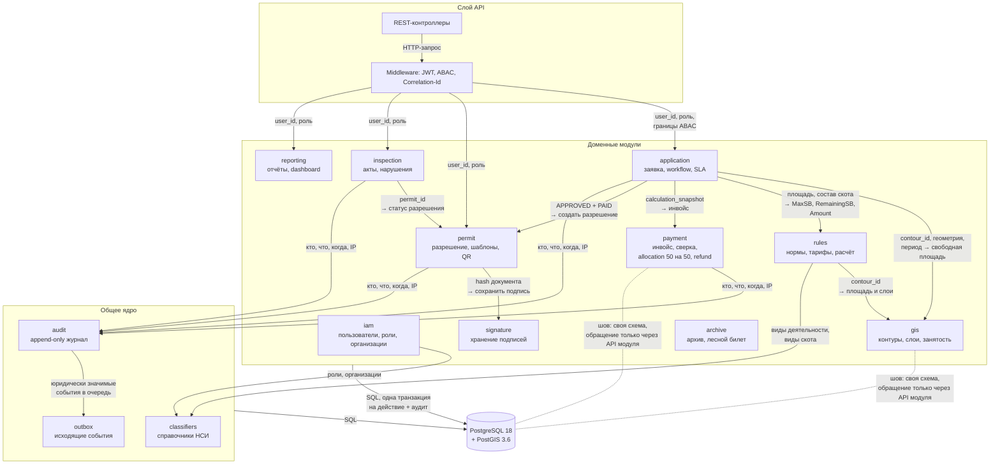

---

## 4. Развёртывание и инфраструктура

Два периметра: публичный и закрытый надзорный. Между ними нет сетевого пути. На стрелках подписаны протокол и то, **что именно пересекает границу и в каком виде** — это важнее самих стрелок.

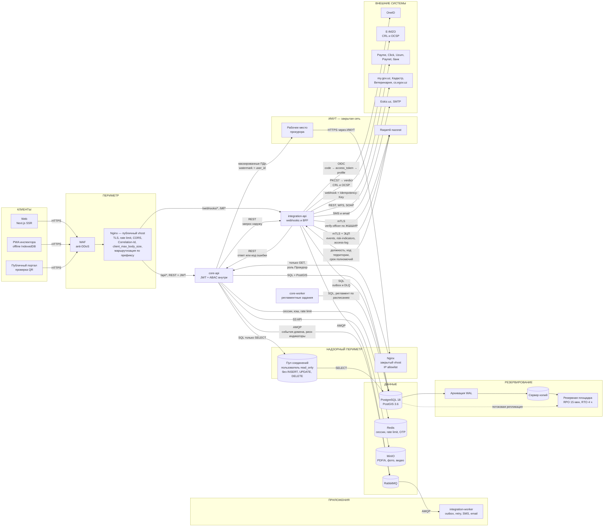

---

## 5. Подача заявки — сценарий С3

Самый нагруженный путь. Проверка укладывается в 5 секунд, вся заявка сохраняется за 3.

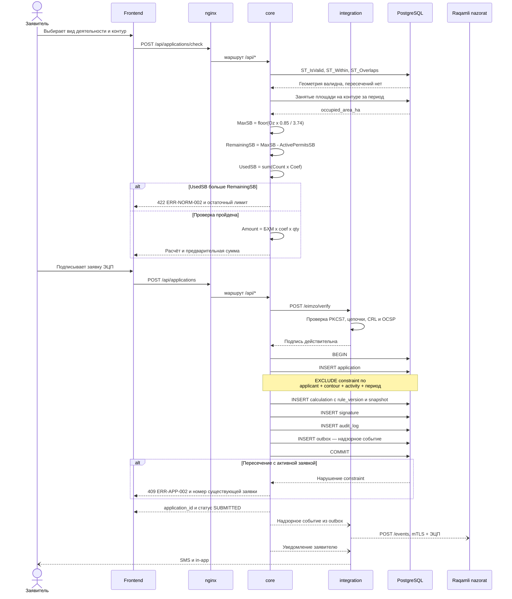

---

## 6. Оплата и выдача разрешения — сценарии С9–С11

Ключевой инвариант: `PAID` ставит только обработчик подписанного webhook.

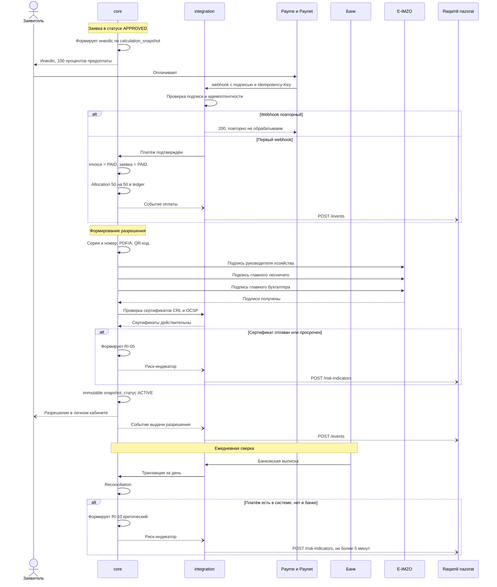

---

## 7. Прокурорский контур — сценарий С22

Верификация выполняется при **каждом** входе, ответ не кэшируется.

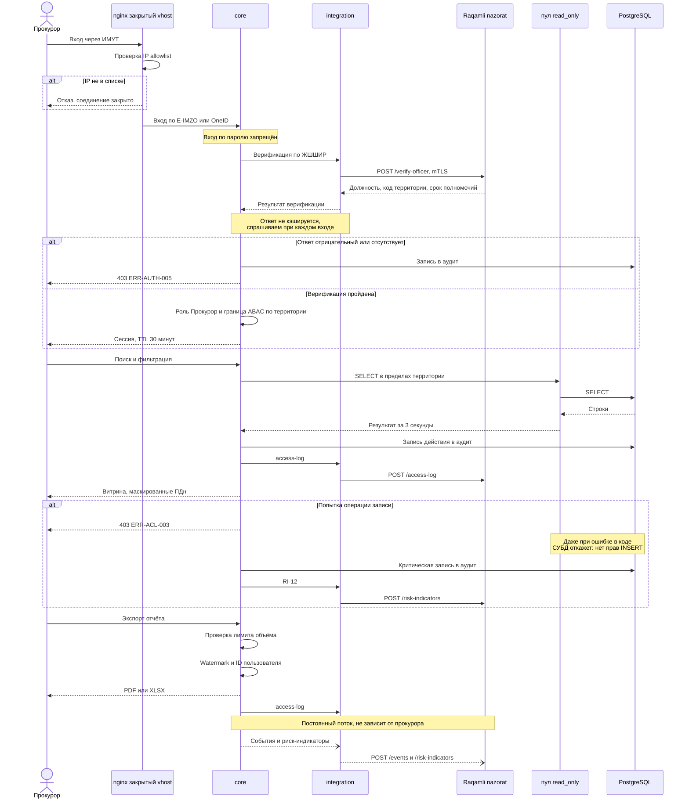

---

## 8. Статус-машина заявки

Полное описание — [`../tz/09-state-machines.md`](../tz/09-state-machines.md). Статус `CONTRACT_DRAFT` в ТЗ упомянут, но не определён — вопрос П3.

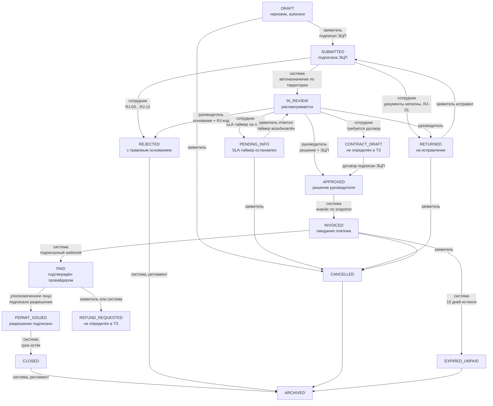

---

## 9. Модель данных

33 сущности из приложения 7 ТЗ — [`../tz/11-data-model.md`](../tz/11-data-model.md). Сущность `contract` в ТЗ упомянута в связях, но не описана — вопрос П5.

### 9а. ER-диаграмма (для mermaid.live и GitHub, в Excalidraw не конвертируется)

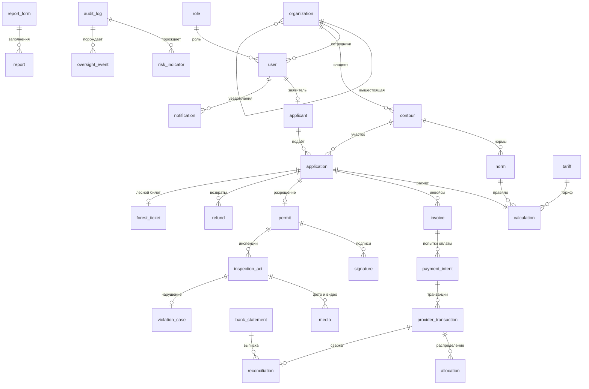

### 9б. Тот же граф на flowchart — конвертируется в Excalidraw

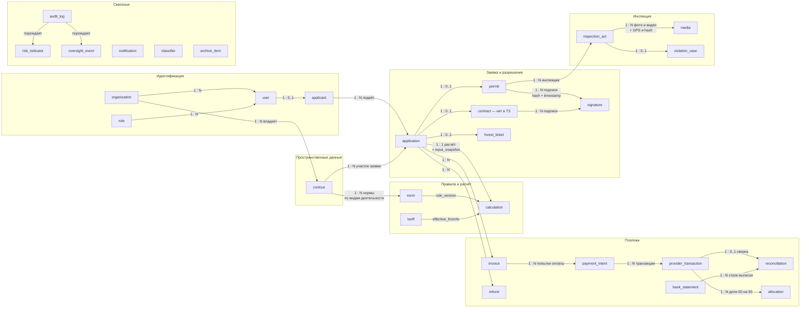

---

## 10. Миграция: маппинг старой БД в новую

Старая схема — Django-монолит `urmonrental`. Разбор кода — [`../tz/20-legacy-code-audit.md`](../tz/20-legacy-code-audit.md).

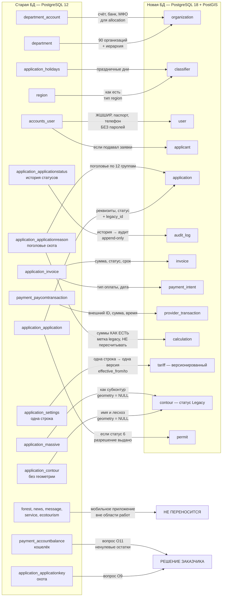

### Что требует особого внимания

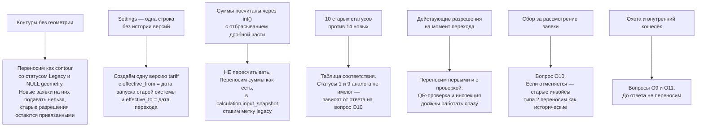

---

## 11. Миграция: фазы перехода

Правило: **ни одна запись не теряется**. Старая БД до полного закрытия остаётся доступной только для чтения.

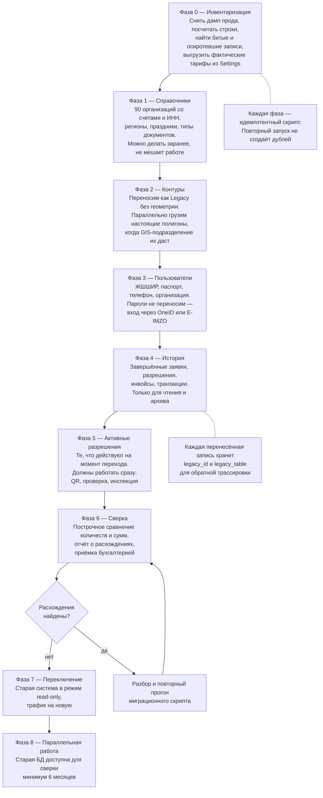

---

## 12. Режим degraded при падении внешних систем

Требование п. 4.1.1.3 ТЗ: при недоступности внешнего сервиса система сохраняет основные функции.

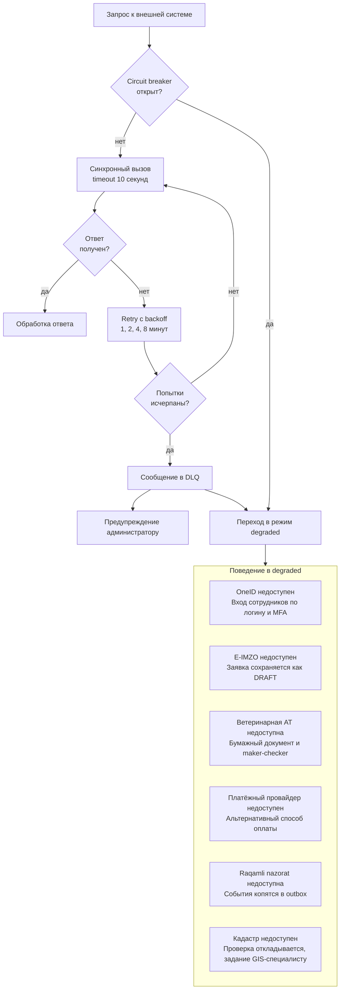

---

## Как это открыть в Excalidraw

1. Скопировать содержимое одного блока — **без строк с тремя обратными кавычками**.
2. Открыть [excalidraw.com](https://excalidraw.com).
3. Меню в левом верхнем углу → **Mermaid to Excalidraw**.
4. Вставить, нажать **Insert**.

Для схем 9а (`erDiagram`) конвертация не сработает — используй вариант 9б или открой её в [mermaid.live](https://mermaid.live) и экспортируй в SVG.
