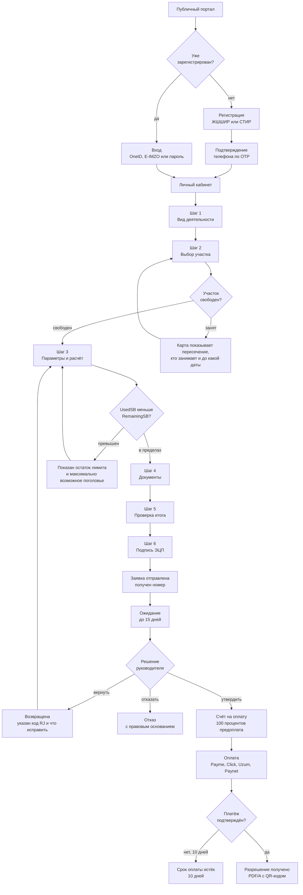
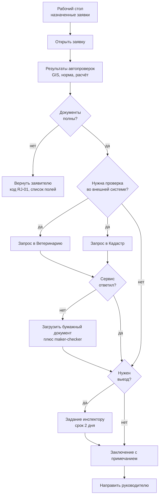
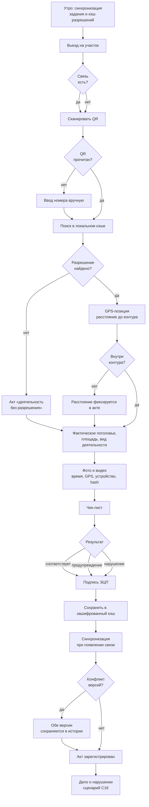
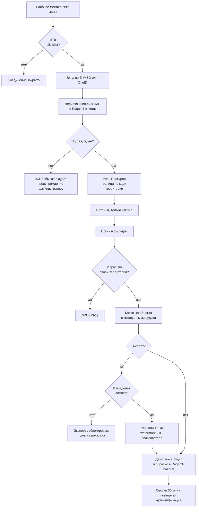
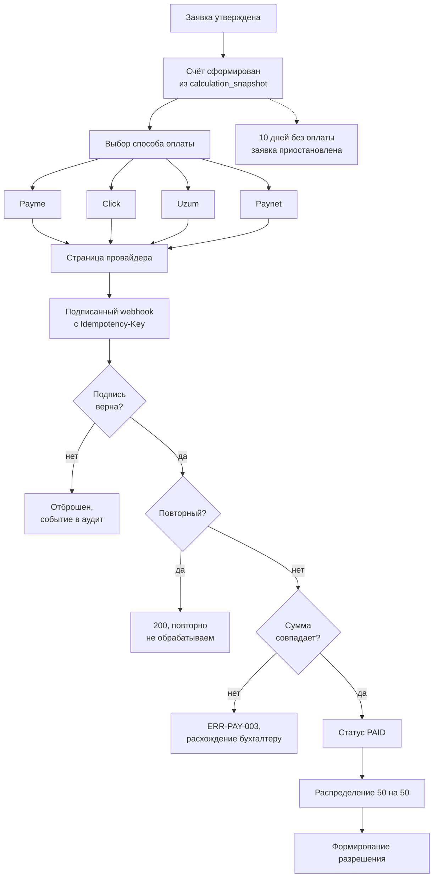

# Потоки пользователей

Сценарии из [`../tz/06-scenarios.md`](../tz/06-scenarios.md) описывают, что делает **система**. Здесь — что делает **человек**: по каким экранам он идёт, где может застрять и что видит при отказе.

Схемы на Mermaid, копируются в [Excalidraw](https://excalidraw.com) так же, как в [`../architecture/diagrams.md`](../architecture/diagrams.md).

---

## 1. Заявитель: от регистрации до разрешения

Главный путь системы. Всё остальное существует ради него.

### Где человек застревает

| Место | Что видит | Что делать дальше |
|---|---|---|
| Участок занят | Пересечение подсвечено на карте, указано разрешение и срок | Выбрать другой участок или уменьшить площадь |
| Нет утверждённой нормы | Причина и **ответственная организация** | Обратиться в лесхоз, заявку подать нельзя |
| Превышен лимит | Остаток `RemainingSB` и максимальное поголовье | Уменьшить заявку до допустимого |
| Ошибка ЭЦП | Причина: сертификат просрочен, отозван, не тот владелец | Перепривязать сертификат в профиле |
| Заявка возвращена | Код `RJ-*`, правовое основание, **список полей к исправлению** | Исправить и отправить заново, номер сохраняется |
| Отказ | Код `RJ-*` и правовое основание | Подать новую заявку или обжаловать |

Черновик сохраняется автоматически на каждом шаге. Уход со страницы — предупреждение.

---

## 2. Сотрудник лесхоза: обработка заявки

**SLA-таймер** идёт с момента назначения. При запросе дополнительной информации у заявителя таймер **останавливается** и возобновляется по получении ответа. Нарушение срока порождает `RI-07`.

---

## 3. Инспектор: полевая проверка без связи

Единственный поток, где offline — норма, а не исключение.

### Три offline-состояния экрана

У каждого экрана PWA их три, и третье забывают чаще всего:

| Состояние | Что показываем |
|---|---|
| Онлайн | Всё доступно |
| Offline, данные в кэше | Плашка «нет связи, данные от 08:15», действия работают, отправка отложена |
| Offline, данных нет | **Объяснить, что именно недоступно и когда появится**, а не показывать пустоту |

Правило разрешения конфликтов синхронизации в ТЗ не задано — вопрос **П8**.

---

## 4. Прокурор: вход и просмотр

Верификация выполняется при **каждом** входе, ответ не кэшируется. Уволили прокурора — доступ пропадает в тот же день без участия администратора.

---

## 5. Оплата: четыре провайдера, один результат

Для пользователя различие между провайдерами заканчивается на странице выбора. Дальше поток одинаковый — это и обеспечивает общий интерфейс адаптера.

---

## Что из этого следует для интерфейса

**Каждая развилка на схемах — это экран или состояние, которое надо нарисовать.** Их больше, чем «счастливых путей»: на пять успешных шагов приходится примерно столько же отказных.

**Отказ — полноценный экран, а не тост.** Пользователь должен уйти с него, зная, что делать: код `RJ-*`, правовое основание, список полей, телефон поддержки.

**Три состояния у каждого экрана PWA.** Умножает объём работы по инспекторскому модулю примерно вдвое.

**Расчёт показывается с расшифровкой.** На шаге проверки человек видит не только сумму, но и откуда она взялась: норма, `MaxSB`, `RemainingSB`, `UsedSB`, тариф, БҲМ. Это прямо снижает число обращений в поддержку и обжалований.
